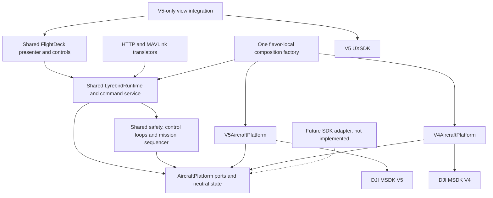

# SDK-Neutral Aircraft Bridge and Flavor Plan

Date: 2026-09-15

Architecture review: 2026-09-18.

Status: partial implementation. V5 flavor scaffolding and bootstrap separation are committed;
further V5 source relocations are staged in the reviewed worktree. The SDK-neutral platform
bridge and activity-independent application runtime are not yet implemented. V4 variants remain
disabled; V4 registration, connection, and flight behavior are not qualified.

## Architecture Decision

Adopt one shared application runtime over an SDK-neutral `AircraftPlatform` facade composed of
small hardware ports. Each APK supplies exactly one implementation through its flavor-local
composition root. Keep flight algorithms, authority, command policy, mission sequencing,
protocol serialization, and video consumers shared; translate SDK values and operations only
inside adapters. Treat a possible SDK 6 as a future adapter, not as an API whose behavior is
already known.

Source relocation is preparation, not proof of this boundary. The reviewed runtime still
uses activity callbacks to supply command backends and telemetry. For example,
`FlightDeckActivity.onDestroy()` stops detection and ends the flight log, while
`ProcessNetworkRuntime` emits empty telemetry after its activity binding is detached. Finishing
the bridge therefore includes lifecycle ownership, not just a new interface or another rename.

## 1. Outcome and Scope

Build two independently installable Android apps from the same repository:

| App | Standard variant | Application ID | Purpose |
| --- | --- | --- | --- |
| Lyrebird V5 | `currentV5` | `com.lyrebird.rc` | Existing V5 aircraft support; preserves the installed app's upgrade identity |
| Lyrebird V4 | `currentV4` | `com.lyrebird.rc.v4` | Qualified aircraft supported by DJI MSDK V4 |

Both apps can be installed on the same supported phone. Only one may own an active DJI connection and Lyrebird network-server session at a time. The operator launches the appropriate app; each app detects the product and its capabilities within its own SDK family. There is no in-process SDK switching or automatic cross-app handover during flight.

The initial phone target is the same phone and Android build already used for the current Lyrebird V5 app. Record that existing baseline during qualification; do not select a different phone, add older/32-bit phones, or lower Android requirements to accommodate V4. A compatibility blocker on that baseline requires an explicit decision, not a silent change of target. The controller must still be compatible with the chosen V4 aircraft and may differ from the V5 aircraft's controller.

Preserve the existing `demoBiomass` product variant as V5 initially. It is not part of the standard two-app delivery; do not remove it or silently start distributing a third app. Enable a V4 demo variant only if separately requested.

The first release targets one explicitly qualified V4 aircraft/controller/firmware/phone combination, alongside regression-tested V5 combinations. Adding V4 does not imply that every historical DJI product, controller, Android version, or native mission feature is supported.

## 2. Corrected Planning Assumptions

- Both SDK generations support relevant phone-connected configurations; V5 is not restricted to smart controllers, and V4 also has compatible smart-controller configurations. Compatibility is a hardware/firmware/Android tuple, not simply "phone versus RC."
- The earlier AAR inspection found a duplicate bootstrap class and overlapping native-library filenames. Separate APKs avoid those collisions. A shared package prefix alone is not proof of a collision, and this plan does not depend on claiming that every possible custom-loader solution is impossible.
- V4 has a keyed interface, introduced in 4.0, as well as component APIs. Do not recreate V5's key DSL as the application's abstraction.
- V4 `FlightControlData` uses physical values according to configured modes: meters/second, meters, degrees, or degrees/second. It is not a universal normalized +/-1 interface. Axis names, signs, modes, limits, and command cadence need adapter tests and hardware confirmation.
- V4 supports native waypoint APIs on some aircraft, including different mission-operator generations. They are not the V5 KMZ/WPMZ interface. Other V4 aircraft require app-executed virtual-stick missions.
- V4's compressed video feed is not a drop-in replacement for Lyrebird's decoded frame input. Decode and normalize it before reusing the existing WebRTC and local-inference pipeline.
- DJI onboard AutoSensing and Lyrebird's local TFLite detection are separate capabilities. Local inference remains reusable on V4 once decoded frames are available.
- A stale public release does not establish an official end-of-life policy. Treat V4 maintenance, modern Android compatibility, registration, and native-library support as risks to validate, not settled guarantees.

No device registration, mixed-install test, flight test, or V4 build against Lyrebird's toolchain has been performed for this plan.

## 3. Architecture: One Runtime, One Platform Facade

Use ports and adapters: application behavior depends on contracts owned by Lyrebird, and each
SDK adapter translates to those contracts. `AircraftPlatform` is a small facade grouping those
ports, not a universal DJI wrapper, a second controller, or a registry of arbitrary SDK objects.
Consumers receive the particular port they need; only the composition root needs the whole facade.

Keep the existing SDK-free Android library `:lyrebird-core`. Put hardware contracts, neutral
state, and testable control/mission policy there; keep Android services, preferences, UI, and
WebRTC/TFLite orchestration in shared app code where appropriate. SDK-free does not mean every
Android or video implementation must move into core. Extra adapter modules, a DI framework,
reflection, and a plugin loader are unnecessary for the first implementation.

The arrows below show compile-time dependencies, not the direction of telemetry callbacks:



The factory alternatives are mutually exclusive at build time. A V5 APK constructs one
`V5AircraftPlatform`; a V4 APK constructs one `V4AircraftPlatform`. It does not load both SDKs
and choose by aircraft model after launch. Separate APKs and source sets solve packaging;
the bridge solves code reuse. Both are needed.

### The facade and its ports

Conceptual API only; introduce each port with a real V5 implementation and a shared consumer,
not a batch of unused interfaces. Names other than the existing telemetry contract are proposed.

```kotlin
interface AircraftPlatform {
    val telemetry: AircraftTelemetrySource
    val flight: FlightPrimitives
    val camera: CameraPort
    val gimbal: GimbalPort
    val media: MediaPort
    val video: DecodedVideoSource
    val nativeMissions: NativeMissionPort
    val capabilities: AircraftCapabilities
    val lifecycle: AircraftConnection
}
```

| Port | App-owned meaning | Adapter responsibility |
| --- | --- | --- |
| Telemetry/connection | Identity, component availability, timestamped state, connection generation, closeable subscriptions | Subscribe to SDK keys/components once, map values, invalidate the old connection, fan out neutral updates |
| Flight primitives | Takeoff, land, RTH, control-mode acquisition/release, typed flight setpoints, supported limits | V5 actions/virtual stick or V4 `FlightController`; unit/axis mapping, mode ordering, bounded send cadence |
| Camera/gimbal | Capture, recording, zoom, camera selection, gimbal aim and explicit reference frames | SDK commands and asynchronous results, per-camera serialization and capability limits |
| Media | Typed media descriptors/IDs, list and download, capture-to-file correlation | SDK media objects, download mode, transfer callbacks and resource cleanup; no HTTP JSON rendering |
| Decoded video | Timed frames with explicit format, dimensions, planes/stride and lifetime | V5 frame listener or V4 compressed feed plus decoder; no consumer depends on a DJI camera index |
| Native missions | Validate representability, upload/start/stop, normalized progress | SDK-specific compiler/operator; V5 WPMZ remains here, not in the shared sequencer |
| Optional features | Explicitly described sensor, onboard detection, payload and vendor-streaming capabilities | Real supported operations or explicit unsupported/unavailable results; never successful no-ops |

Native streaming is optional, separate from `DecodedVideoSource`. WHIP/WHEP remains the shared
public video path. DJI native RTMP/RTSP/Agora/GB28181 support must not become a prerequisite for
a backend that can provide decoded frames. Local TFLite inference is a shared consumer, not an
SDK capability; only onboard inference belongs behind a hardware capability.

### Preserve the application layer

Keep `LyrebirdFlightPort`, `LyrebirdMediaPort`, `MavlinkMotionSink`, `MavlinkCommandSink`,
`MavlinkMissionSink`, `CommandResult`, `PendingCommand`, and `GimbalRotation` where they already
express application/protocol intent. Do not implement a fresh set of SDK-specific HTTP/MAVLink
policies. The media port's JSON/stream response methods are transport-facing, not the new
hardware boundary. The joystick-shaped `StickCommand` is not a universal physical setpoint.

The intended command path is:

```text
UI / HTTP / MAVLink
  -> protocol normalization and authenticated command origin
  -> shared command service: authority, capabilities, validity, cancellation
  -> shared goto/orbit/ROI/mission algorithm OR a hardware primitive
  -> the selected SDK adapter
```

Takeoff's follow-up climb, waypoint arrival, PID gains, cancellation IDs, physical-RC override,
Safety takeover, and app-executed mission sequencing remain shared. A `FlightPrimitives` port
does not contain a separately implemented `gotoWaypoint()` loop for each SDK. Native missions
are deliberately different: the shared service selects the requested executor, then calls its
native adapter only if the entire plan is representable.

Telemetry flows back as neutral observations into one runtime-owned state store. TCP, MAVLink,
fleet, video metadata, logging, and UI use projections of that store, not independent reads
through activity callbacks. This does not assert that every SDK sensor was sampled at the same
instant; per-field observation metadata must retain that distinction.

### Contract semantics, not just matching signatures

- **Physical intent:** distinguish body forward/right velocity from north/east velocity, up
  velocity from altitude-position targets, and clockwise yaw rate from absolute heading.
  Use typed mode/setpoint variants and named units. Keep normalized manual-stick input separate.
  Adapter tests must prove signs and axes for both SDKs; do not infer them from `pitch`/`roll` names.
- **Altitude:** encode takeoff-relative, home-relative, and MSL references explicitly. The current
  `GeoPosition.altitudeAslM` name is not proof of an SDK altitude datum. Verify each mapping;
  reject unsupported conversions rather than inventing MSL from a relative height or zero.
- **Validity:** reuse `AircraftState`, `AircraftReadings`, `Reading<T>` and the existing wire
  serializers, but add the missing observation/validity path deliberately. `AircraftReadings`
  currently preserves legacy default values, and the envelope timestamp is not per-field
  freshness. A compatibility serializer may keep old wire defaults; control eligibility must
  not mistake those defaults for measurements. Separate this policy change from mechanical moves.
- **Clocks:** measure freshness, deadlines and control refresh against a monotonic clock; retain
  wall-clock timestamps separately for logs/wire formats that need them. An SDK-provided capture
  time is not automatically comparable to the runtime clock, and process restart creates a new epoch.
- **Async results:** distinguish dispatch/SDK acceptance from observed completion. Each operation
  carries a runtime operation ID and connection generation; ignored, timed-out, cancelled, or
  superseded callbacks cannot complete a later operation. Map adapter error categories into the
  existing command results at the application boundary; retain raw vendor detail only for diagnostics.
- **Capabilities:** distinguish supported, unsupported, temporarily unavailable, and unknown,
  with limits, modes, reasons and current component identity. Product/firmware capability data
  changes on reconnect; SDK number alone is insufficient. Shared code branches on capabilities,
  never on `sdkVersion == 4` or a vendor enum ordinal.
- **Subscriptions:** one adapter owns each SDK listener registration and exposes fan-out with
  idempotent subscription disposal. Keep critical flight-state consumers alive when a UI
  subscriber detaches. Late events from old components cannot overwrite a new generation.
- **Concurrency:** serialize SDK lifecycle/mode changes using an explicit dispatcher or scheduler.
  Keep command cancellation responsive; blocking FTP/capture/inference cannot occupy the
  flight-control queue. Telemetry and video may use latest-value/backpressure policies; operation
  outcomes and safety events must not be silently dropped.
- **Frames:** negotiate supported decoded formats and document timestamp clock, rotation,
  dimensions, stride/planes, buffer bounds and release rules. Borrowed SDK buffers are valid
  only for their documented callback lifetime; async consumers retain an owned buffer or copy.
  Preserve the current in-flight-frame drain before disposal. Prefer an SDK-free frame descriptor
  in core and a shared Android/WebRTC conversion layer, not `DJICodecManager` or `MediaFormat`
  leaking into consumers. Do not force an extra full-frame conversion where formats already match.
- **Control refresh:** keep controller computation and SDK send cadence explicit and testable.
  Any adapter refreshing a last setpoint must also obey operation expiry and cancellation;
  disconnect/takeover must invalidate it. Never replay a stale setpoint after reconnect.

### Composition and lifetime

Replace the collection of independently accessed `Process*Registry` service locators incrementally
with one runtime-owned dependency graph. Retain delegating shims during migration if necessary,
but they must not create a second instance or make controllers look up concrete V5 services.
Manual constructor injection is sufficient. Match existing callbacks first with a closeable
subscription handle; adopting Flow internally is optional, not a requirement for the bridge.

The shared application/service owner holds the platform and coordinators strongly. Weak or
lifecycle-bound references are for UI observers only, not for required telemetry, settings,
safety, or command backends. Closing an old UI subscription must not detach a newly attached
screen. Activity destruction does not end a flight log, stop detection, zero obstacle motion,
or remove the flight-state consumer that updates RC-override eligibility.

The runtime must acquire the device lease before any operation capable of registering/connecting
an SDK or starting live workers. Creating a Kotlin singleton that eagerly calls SDK managers is
not a substitute for a gated start method. Keep loader installation separate and qualify whether
it has connection side effects. On an explicit safe shutdown: reject new work, invalidate/cancel
operations, stop control refresh and missions as appropriate, drain frame/media work, stop SDK
subscriptions/publishers/endpoints, execute the validated SDK shutdown sequence, then release the
lease last. OS process death has no reliable cleanup callback and never implies safe flight resume.

### UI and source placement

Do not require a shared activity to inherit the V5 `DefaultLayoutActivity`. Share the presenter,
screen state, controls and command/session services first. Keep the existing V5 activity as a
small platform view shell while preserving UXSDK behavior; a V4 shell consumes the same presenter.
An app-layer view integration interface may use Android views, but core contracts may not.
Do not rewrite the entire V5 UI merely to introduce the hardware bridge.

Audit command-capable UXSDK widgets separately: a shared presenter does not intercept a widget's
internal SDK calls. Command entry points must obey Lyrebird's authority/cancellation policy;
where a widget cannot be routed through that policy, replacing or constraining it requires
explicit safety/UI review, not an assumed exemption for vendor code.

Target placement, not a claim about the current worktree:

```text
lyrebird-core/src/main/       AircraftPlatform ports, state, shared policy/control/protocol
lyrebird-core/src/test/       Fake platform and hardware-free contract/control tests
lyrebird-app/src/main/        Shared Android runtime, presenter, settings, video consumers
lyrebird-app/src/v5/          V5 factory/adapters/bootstrap and retained UXSDK/sample UI
lyrebird-app/src/v4/          V4 factory/adapters/bootstrap and minimal platform UI
lyrebird-app/src/test/        Shared runtime/presenter/serialization tests
lyrebird-app/src/testV5/      V5 mapping and adapter tests
lyrebird-app/src/testV4/      V4 mapping and adapter tests
android-sdk-v5-uxsdk/         V5 dependency only
```

No `src/v6` or speculative V6 implementation is required now. A future SDK adds its dependency,
manifest/bootstrap, factory and adapters, passes the same conformance tests, then qualifies its
hardware. Existing shared behavior should stay unchanged for already-supported capabilities.
Genuinely new hardware semantics may require an additive contract change and tests; no design can
guarantee zero shared changes for an undocumented future SDK.

### Alternatives and tradeoffs

| Approach | Decision |
| --- | --- |
| Copy FlightDeck/controllers per SDK | Reject: duplicates safety, sequencing and protocol behavior; fixes drift across versions |
| One large wrapper exposing vendor keys or `Any` values | Reject: hides imports, not semantics; SDK-specific casts and mode branches escape into the app |
| A separate SDK process behind an internal MAVLink/HTTP bridge | Defer: adds IPC, failure modes and high-bandwidth frame ownership; existing protocols do not cover all media/settings/video contracts |
| One neutral facade over small ports, selected by flavor | Recommend: keeps one application and one safety policy; limits per-SDK work to adaptation and qualification |

This is simpler in ongoing maintenance, not a zero-cost abstraction. Telemetry/command mapping,
media state machines and video decoding still need genuine per-SDK implementations and device
tests. It does not turn unsupported features into a lowest-common-denominator fake success.

## 4. Existing Code to Adapt

Audit of the 2026-09-18 worktree at `5b0c032`, including 189 staged source relocations and an
unstaged Gradle source-root addition. Those source changes were preserved during this
documentation-only review. Paths below describe that worktree; the proposed facade is not yet code.

| Current evidence | Required bridge work |
| --- | --- |
| [AircraftReadings / AircraftTelemetrySource](../lyrebird-core/src/main/java/com/lyrebird/rc/telemetry/AircraftReadings.kt), [AircraftState](../lyrebird-core/src/main/java/com/lyrebird/rc/telemetry/AircraftState.kt) and [Reading types](../lyrebird-core/src/main/java/com/lyrebird/rc/telemetry/TelemetryReadings.kt) are neutral; the interface exposes only `read()` | Extend the existing boundary for state/subscriptions and validity; do not introduce a parallel incompatible telemetry model |
| [LyrebirdCommandPorts](../lyrebird-app/src/main/java/com/lyrebird/rc/LyrebirdCommandPorts.kt) and [HTTP server](../lyrebird-app/src/main/java/com/lyrebird/rc/LyrebirdHttpServer.kt) use neutral command/media values | Preserve these application/protocol contracts; inject a shared command service below them and typed hardware media beneath the HTTP serializer |
| [DroneController](../lyrebird-app/src/v5/java/com/lyrebird/rc/controller/DroneController.kt) mixes PID/arrival logic with V5 keys, VMs and virtual-stick parameters | Extract flight primitives and telemetry dependencies; return the algorithms to shared code without retuning or copying them for V4 |
| [ControlAuthority](../lyrebird-app/src/main/java/com/lyrebird/rc/controller/ControlAuthority.kt) directly calls the now V5-local `DroneController.onSafetyTakeover()` | Inject a shared cancellation/control owner; preserve the persisted per-aircraft Safety latch and independent physical-RC override |
| [V5MavlinkCommandSink](../lyrebird-app/src/v5/java/com/lyrebird/rc/controller/V5MavlinkCommandSink.kt) hosts V5 keys/VMs and settings/ROI callbacks; [V5MavlinkMotionSink](../lyrebird-app/src/v5/java/com/lyrebird/rc/controller/V5MavlinkMotionSink.kt) contains shared command policy | Split hardware translation from command policy; the shared sinks must not require an Activity or a V5 host |
| [V5MavlinkMissionSink](../lyrebird-app/src/v5/java/com/lyrebird/rc/controller/V5MavlinkMissionSink.kt) contains both `startOnboard` and `startNative` | Share the existing app sequencer; keep [WaylineMissionHelper](../lyrebird-app/src/v5/java/com/lyrebird/rc/controller/WaylineMissionHelper.kt) and WPMZ compilation in the V5 native adapter |
| [FlightDeckActivity](../lyrebird-app/src/v5/java/com/lyrebird/rc/FlightDeckActivity.kt) owns the sink instances, `isAirborne`/RTH observer effects, armed/home state and telemetry projection; `onDestroy()` still stops detection and ends logging | Move business state/effects into the runtime; retain permission/picker/view handling and V5 widget integration only |
| [ProcessNetworkRuntime](../lyrebird-app/src/main/java/com/lyrebird/rc/server/ProcessNetworkRuntime.kt) falls back to `{}`/failed commands when detached; its discovery lambda also captures `host` strongly | Bind network services to a runtime-owned command/state provider, not a weak activity backend; audit closure captures as well as declared weak references |
| [ProcessTelemetryRuntimeRegistry](../lyrebird-app/src/v5/java/com/lyrebird/rc/telemetry/ProcessTelemetryRuntimeRegistry.kt) retains the source but `detachUiObservers()` clears its flight-state observer | Split permanent flight-state consumers from disposable UI observers and keep neutral state updating without a screen |
| [ProcessObstacleRuntime](../lyrebird-app/src/main/java/com/lyrebird/rc/server/ProcessObstacleRuntime.kt) substitutes zero motion when its activity callback disappears | Feed shared guard policy from valid runtime telemetry, with unknown/unavailable data explicit; do not remove braking protection by detaching UI |
| [ProcessStreamingRuntime](../lyrebird-app/src/v5/java/com/lyrebird/rc/server/ProcessStreamingRuntime.kt) owns publishers but still requires callbacks for settings/start; `restartActiveStreaming()` reuses healthy-client suppression | Own settings/target/status in shared orchestration; distinguish explicit reconfiguration from duplicate client discovery, and test detach/restart behavior |
| [SharedDJIFrameSource](../lyrebird-app/src/v5/java/com/lyrebird/rc/webrtc/SharedDJIFrameSource.kt) combines V5 NV21 acquisition with fan-out; inference/metadata use UXSDK target types | Keep acquisition V5-local; reuse common frame processing, `DetectedTargetSnapshot`, WHIP and TFLite with SDK-free consumers |
| [Payload](../lyrebird-app/src/v5/java/com/lyrebird/rc/controller/Payload.kt) mixes capture/download workflows and V5 operations | Keep one shared workflow over camera/media ports; move V5 manager objects and optional LRF/thermal/payload access into adapters |
| [V5 bootstrap](../lyrebird-app/src/v5/java/com/lyrebird/rc/DJIAircraftApplication.kt), [shared manifest](../lyrebird-app/src/main/AndroidManifest.xml), and [build configuration](../lyrebird-app/build.gradle) still have unresolved isolation work | Keep the lease gate; audit loader ordering, flavor manifests/resources and compiler inputs before enabling V4 |

These are static source findings, not device reproductions. The existing SDK-free core and
protocol tests are a useful base; a green V5 compile does not exercise detach/rebind behavior
or prove that common sources compile without V5. This review does not modify runtime behavior.

## 5. Build, Identity, and Packaging

1. Keep `appVariant` as the first flavor dimension and add `sdk` second, with `v5` and `v4`. This gives `currentV5Debug`, `currentV4Debug`, and `demoBiomassV5Debug`. Disable `demoBiomassV4` initially through the supported variant API.
2. Keep V5's application ID and existing signing identity for upgrades. Give only V4 the `.v4` suffix. Distinct IDs, not distinct labels alone, make side-by-side installation possible. Manage version codes independently for the two application IDs.
3. Use recognizable V4/V5 app labels and icons. Give APKs unambiguous names such as `Lyrebird-current-v4-debug.apk` and `Lyrebird-current-v5-debug.apk`; update installers and CI artifact paths accordingly.
4. Scope V5 SDK runtime/provided dependencies and `project(':uxsdk')` to V5. Scope `com.dji:dji-sdk:4.18` and compile-only `com.dji:dji-sdk-provided:4.18` to V4. Audit transitive dependencies, manifests, resources, and native libraries, not only direct imports.
5. Keep SDK-provided artifacts compile-only and the correct runtime artifact in each APK. Never resolve cross-generation bootstrap/native conflicts with `pickFirst` or by importing both SDKs into common source.
6. Preserve current V5 key configuration. Introduce a separate V4 key setting, for example `AIRCRAFT_API_KEY_V4`, registered for `com.lyrebird.rc.v4`. Do not fall back to V5's key when V4 credentials are missing. Retain the existing V5 demo key behavior.
7. Keep secrets in machine-local configuration or CI secrets. Provision each app separately; check any package/signing restrictions on map services too. Never copy keys from RosettaDrone or commit credentials.
8. Keep Android SDK/toolchain settings and ARM64 support unchanged initially. The current app uses min SDK 24 and compile/target SDK 36. Verify V4 compatibility with this toolchain and the actual phone, including native page-size requirements; do not downgrade the shared V5 build to match an old sample project.
9. Retain `${applicationId}`-qualified provider authorities. Preferences, caches, downloaded media, backups, and runtime security state must be app-private. Audit hardcoded shared-storage paths, intent actions, and providers. Do not use a shared UID or automatically copy safety/signing credentials between apps.
10. Move SDK-dependent Java/Kotlin, layouts, view-binding inputs, navigation entries, styles, manifest activities, and sample screens out of common source. Hiding a screen at runtime does not stop its source or generated binding from requiring V5 classes.

An optional later settings export/import can transfer non-secret preferences, with capability validation and explicit confirmation. It is not needed for initial side-by-side installation.

### Current packaging gaps to close

- The reviewed [app build](../lyrebird-app/build.gradle) adds `src/v5/java` to the Android
  **main** source set, alongside a V5-only Kotlin task hook. Physical placement is therefore
  not isolation. Register Java and Kotlin through the supported flavor source configuration for
  the installed AGP/Kotlin versions; prove actual compiler inputs for debug, release and tests.
  Do not preserve a task-name workaround as the architecture or solve it by sharing V5 with V4.
- The shared manifest still names V5 application/UXSDK classes, and shared resources include
  SDK-bound layouts/navigation. Move those declarations and generated-binding inputs to V5;
  preserve the existing sample features there. Audit indirect dependencies as well as `dji.*` imports.
- [CI](../../.github/workflows/ci.yml) uses V5 compile/test names, but
  [manual hooks](../../.pre-commit-config.yaml) and [quality tasks](build.gradle) retain old app
  variant names. The [installer](auto_install_on_connect.sh) defaults to `current` and constructs
  `Lyrebird-currentV5-debug.apk`, whereas the build names `Lyrebird-current-v5-debug.apk`.
  Reconcile task names, defaults and artifacts, preferably using AGP output metadata, and test
  both default/alias selection and demo selection. Shell syntax alone cannot establish correctness.
- V4 dependency coordinates are documented, not unknown: DJI's official sample declares
  `com.dji:dji-sdk:4.18` and `com.dji:dji-sdk-provided:4.18` (see references). A local reference
  checkout was inspected in this review. Absence from a Gradle cache is not a provisioning blocker.
  Resolution, transitive/native inspection, compatibility with this toolchain and real registration
  still need to be demonstrated; this documentation pass did not download or build a V4 artifact.

## 6. Same-Phone Session Ownership

Separate application IDs do not isolate network ports or grant simultaneous access to the same USB accessory.

- Introduce a shared session coordinator implementation used by both APKs. Before SDK connection startup, acquire a process-held device-local exclusive lease, for example a dedicated loopback listening socket. Qualify the chosen primitive on target Android devices; acquire by binding, not by checking and then binding.
- The lease is cooperative between the Lyrebird apps, not an aircraft safety authority or an Android USB permission. It does not prevent DJI Fly/Pilot or unrelated apps from competing for the accessory.
- Keep the inactive app available for offline settings/status, but do not let it initialize a competing product connection, start control loops, publish WHIP, or bind/advertise the shared server endpoints. Report ownership/bind errors visibly instead of silently running a partial server stack.
- Audit V4 auto-started SDK services/receivers and application bootstrap so they cannot bypass connection ownership. Keep each flavor's required loader initialization separate from the decision to register/connect its SDK.
- Retain the existing public ports: MAVLink UDP 14550, HTTP 8080, telemetry TCP 8081, and discovery UDP 30000. Start endpoints transactionally; roll back partial startup and advertise only endpoints that actually started, with honest connection state.
- Handle Android's USB app chooser and remembered default explicitly. Both apps may match the same accessory filter; USB identity is not a dependable aircraft-model selector. Never promise automatic family selection before SDK initialization.
- Keep session lifetime independent of activity recreation. For sustained/background operation, validate the shared service owner and required foreground-service declarations/permissions against Android and DJI lifecycle requirements. Losing UI focus must not silently drop an active flight session.
- Normal app switching requires a safe stopped session, normally landed with confirmed state. Stop/cancel application operations, apply the validated SDK shutdown sequence, stop publishers/listeners/servers, unregister discovery, then release the lease. The second app never forcibly terminates the first.
- Process death releases the lease but does not prove the aircraft is landed or that a native mission stopped. A subsequent session reconciles aircraft state and never automatically resumes commands or takes over flight. Link-loss behavior remains an independently tested aircraft/SDK failsafe.

Preserve the existing authority model: Safety takeover has no timeout, only Safety may release
it, and physical RC override remains a separate latch. `AuthorityLatch` and `SafetyLatchStore`
now persist Safety authority per aircraft within the app; the older description of an entirely
in-memory latch is obsolete. Restore it before accepting commands for the resolved identity.
Move persistence wiring out of the activity into the shared runtime without weakening its rules.

Persistence within one app is not shared authority across application IDs. The other APK cannot
infer that control was released from an empty app-private preference store. Require an explicit,
grounded handover/reconciliation policy; do not automatically copy secrets/latches, reset Safety,
resume commands, or treat app switching as release. This remains a cross-app qualification/design
gate, not a guarantee provided by the bridge or the cooperative lease.

## 7. Capability and Mission Policy

| Capability | V5 | V4 initial release |
| --- | --- | --- |
| HTTP, MAVLink, TCP telemetry, discovery, signing, authority | Preserve current behavior | Same shared implementations |
| Takeoff, landing, RTH, virtual stick | Existing support | Adapt and qualify per target aircraft |
| Goto, yaw, altitude, orbit, ROI | Shared controller/policy | Same algorithms through V4 adapters; camera/aircraft limits apply |
| App-executed missions | Existing `ONBOARD` executor | Reuse it; do not import a second mission sequencer |
| Aircraft-native missions | Existing V5 compiler/executor | Explicitly unsupported until the relevant V4 operator adapter is qualified |
| Photo, recording, gimbal, media download | Existing support | Implement available operations; serialize mode changes and honor media-download limitations |
| Zoom, thermal, LRF, RTK, payload accessories | Existing product-specific support | Capability-gated; no generic parity promise |
| WHIP/WHEP video | Existing path | New decoded-frame adapter, same publishing/playback stack |
| Local TFLite detections | Existing local pipeline | Reuse after decoded-frame and performance qualification |
| DJI AutoSensing | Existing supported products | Unsupported unless an actual equivalent provider is verified |
| Obstacle data/guard | Existing opt-in policy | Use only verified sensors; unavailable/unknown is not "clear" |

The existing `MissionExecutor.fromPref()` defaults to `DJI_NATIVE`, despite an older nearby comment describing another default. Preserve V5's actual preference behavior. For a new V4 installation, explicitly select the shared app-executed executor until V4 native execution is implemented. Preserve the existing `onboard` and `dji_native` wire/preference values.

If a user or imported profile requests unavailable native execution, reject it with an explicit unsupported result. Never silently convert a native mission into a phone-executed mission: their link-loss, scheduling, and continuity behavior differ. Native conversion must reject unrepresentable actions, frames, speeds, or limits before execution, not drop mission items.

Expose capabilities consistently to the app, HTTP, and MAVLink. Additive capability metadata may be needed, but avoid changing the custom MAVLink dialect simply to implement flavors. Preserve current HTTP prose/JSON and TCP field formats with explicit serializers and golden fixtures; changing SDK data classes is not permission to change the public protocol.

For sensor-dependent modes, unavailable required data produces an explicit refusal or an operator-selected mode that does not claim that protection. Never disable DJI onboard avoidance or weaken safety gates merely to obtain V4 compatibility.

## 8. Bridge-First Implementation Batches

This order supersedes the earlier relocation-first interpretation of the phases. Keep each
batch reviewable and V5 operational. A hardware port is complete only when an existing consumer
uses it and the adapter/fake tests exercise it. Do not count new interfaces, renamed files or
process singleton declarations as completed behavior. Preserve staged moves; review which
policy/workflow classes should return to shared code after their SDK access has been removed.

### B0: Reconcile the Baseline and V4 Feasibility

- Record the current staged/unstaged work and V5 tests before another code edit; checkpoint
  source-only moves separately from semantic changes. Repair the packaging/tooling gaps in section 5.
- Freeze representative HTTP, TCP and decoded MAVLink fixtures. Reuse existing fixtures and
  tests rather than building a second protocol test system.
- Resolve and inspect the documented V4.18 dependencies in an isolated bootstrap/bench step.
  Pin the resolved version and inspect duplicate classes, native ABI/page size, merged manifests,
  SDK auto-start components and key requirements. Never load V4 and V5 in one test APK.
  The 2026-09-18 bench record is [V4_FEASIBILITY.md](V4_FEASIBILITY.md): 4.18 resolves and
  builds in this toolchain, its Java API is shell-loaded (`compileOnly` provided jar,
  `com.cySdkyc.clx.Helper`), and the merged SDK components, native ABIs and page alignment are
  recorded there.
- Use the same V5 phone/Android baseline, with an explicitly selected V4 aircraft/controller/
  firmware. Prove registration/reconnect and decoded video on that tuple before committing to
  the full V4 flight rollout. A missing V4 key blocks registration, not neutral interface work.

Gate: reproducible V5 baseline and an honest V4 feasibility report separating resolution, build,
registration, video and hardware checks. A native/startup incompatibility must be resolved before
claiming a deliverable V4 backend. Small V5 bridge improvements can proceed independently.

### B1: Platform Composition and a Telemetry Vertical Slice

- Introduce the minimal `AircraftPlatform`/factory boundary and `FakeAircraftPlatform` in tests;
  add only telemetry/connection capabilities initially. Reuse and evolve the existing neutral
  telemetry types instead of designing a new all-SDK data schema from scratch.
- Create a V5 implementation using the existing source. Let the shared runtime own it, its
  subscriptions and the state/projections feeding TCP, MAVLink and UI.
- Move `isAirborne`, RC-triggered RTH handling, identity/latch restoration and flight-log
  lifecycle effects out of UI observers. UI attach/detach disposes only its own subscription.
- Treat weak activity command bindings as transitional; telemetry must come from the runtime
  even while command migration is still in progress. Unknown/stale state stays explicit.

Gate: injected fake state reaches the existing serializers with compatibility fixtures intact;
two UI observers can attach/detach independently; no-UI telemetry keeps updating; old-generation
callbacks are ignored. V5 mapping is compile-tested and covered by focused adapter tests.

### B2: Shared Flight, Authority and Mission Policy

- First add `FlightPrimitives` and a V5 implementation for existing actions/modes/setpoints;
  test the SDK-argument mapping and asynchronous mode ordering.
- Then inject telemetry, primitives, clock/scheduler and native-mission operations into the
  existing controller. Keep its PID/geometry, sequence IDs, arrival thresholds and timing;
  move that behavior back to shared code only after V5 comparisons pass.
- Move HTTP/MAVLink sink policy and the `startOnboard` sequencer into shared services. Keep
  `startNative` compilation/execution in the V5 native adapter. Do not implement a second V4
  navigation controller or app mission sequencer.
- Inject takeover/cancellation into `ControlAuthority`; authenticate origin at the transport
  boundary, capture it for the operation, and preserve Safety persistence and independent
  physical-RC override. SDK callbacks cannot reset policy or replay cancelled control.

Gate: fake-clock controller/mission tests, V5 argument comparisons, refused-waypoint parity,
accepted-versus-completed results, cancellation/takeover/late-callback tests and RC-override
tests. Dashboard MAVLink/HTTP and V5 bench comparison are mandatory before flight use.

### B3: Camera, Media, Gimbal and Optional Sensors

- Introduce the hardware camera/gimbal/media ports under the existing application command/media
  surfaces. Keep serialized shutter/download workflows and response rendering shared.
- Give capture-to-file correlation and downloads explicit operation/connection identity; remove
  activity references from queued work. Do not deliver an old capture into a restarted endpoint
  or query a replacement aircraft for a previous operation.
- Put ROI scheduling/math in the shared controller using neutral gimbal/telemetry ports;
  keep M400 key rebinding and component selection in the V5 implementation.
- Expose optional LRF/thermal/payload/obstacle readings and limits through capabilities. Feed
  guard policy from runtime state, never zero-motion fallbacks caused by missing UI callbacks.

Gate: capture/download fixtures, command ordering, cancellation during media operations,
component replacement, ROI cancellation/mode restoration, missing-sensor refusals, and no-UI
obstacle inputs. Existing V5 camera/payload behavior receives explicit bench regression coverage.

### B4: Shared Video, Streaming and Detection

- Separate decoded-frame acquisition from `SharedDJIFrameSource` fan-out, processing and
  metadata. Supply the same frame contract to preview, WHIP and local TFLite consumers.
- Replace UXSDK `DetectedTarget` outside view integration with the existing neutral target
  snapshot. Keep model selection, local inference lifecycle and projection shared; onboard
  AutoSensing is an optional V5 provider.
- Make streaming settings, target suppression, explicit restart/reconfiguration and metrics
  runtime-owned. Keep V5 native-stream configuration behind an optional port, not weak getters
  that turn into empty credentials/configuration when the screen closes.
- Preserve in-flight frame drain, buffer release/retention and one source registration across
  consumer changes. Bound queues and prove inference cannot starve command scheduling.

Gate: frame format/stride/lifetime and consumer-detach tests; duplicate discovery does not
restart a healthy stream, explicit settings changes do; detection and metrics survive UI
recreation; WHIP -> MediaMTX -> WHEP bench playback remains the only public video workflow.

### B5: Finish Runtime Ownership and the Platform View Shells

- Consolidate startup/stop ordering under the shared application runtime. Registries become
  temporary delegates, not separate lifetime authorities. UI depends on presenter/state and
  commands; SDK initialization never depends on a screen being opened.
- Remove the remaining activity-hosted command, sensor, state and settings callbacks; retain
  only UI-only observers, permissions, pickers and platform view integration.
- Move V5 manifest/resources and retained sample screens into flavor ownership. Replace the
  `src/v5`-added-to-`main` workaround with proven flavor-only Java/Kotlin registration, including
  release and test inputs. Update quality scopes and installer/CI/manual-hook tasks together.
- Audit SDK-issued commands inside retained vendor widgets so the UI cannot bypass shared
  authorization merely because its controller path has been made neutral.
- Add a test harness composing the shared runtime with a fake platform and no DJI SDK/UXSDK;
  use it to expose indirect dependencies, not just search for import strings.

Gate: shared runtime/controller/mission tests compile without DJI, no runtime call depends on
an Activity, stale UI detach cannot remove the current observer, and explicit safe shutdown
releases the lease last. V5 recreation/background behavior still needs device qualification.

### B6: Add the Real V4 Adapter

- Enable `currentV4` only with its real bootstrap, separate key, manifest and V4-only dependency
  graph. Keep `demoBiomassV4` disabled. No placeholder that returns successful SDK operations.
- Implement the ports using the B0-qualified SDK and target. Reuse the same command service,
  controller, sequencer, telemetry serializers, WHIP pipeline and local inference.
- Run the common conformance suite plus V4-specific callback/mode/axis tests. Verify V4
  `FlightControlData` units and 5-25 Hz send cadence; qualify axes and altitude references before
  closed-loop movement. Preserve cancellation while enabling/changing SDK control modes.
- Adapt `VideoFeeder`/decoder output to the tested decoded-frame contract. Measure format,
  stride, timestamp and buffer behavior; recording/photo transitions must not corrupt frames.
- Select the shared app executor for a fresh V4 installation; reject requested native execution
  until implemented. Optional native support is a separate adapter milestone with a representable
  mission subset, original item-index mapping and upload/start/progress/stop tests.

Gate: both APKs build/install with distinct IDs and no cross-generation SDK classes/native
libraries. V4 telemetry, supported camera/media/video and flight primitives pass their bench
gates; unavailable capabilities fail honestly. No app switch or reconnect resumes commands.

### B7: Qualify the Two Apps and Document Extension Rules

- Exercise cold start, both app launch orders, USB chooser/defaults, reconnect, stale callbacks,
  recreation, screen lock, port conflicts, partial startup failure, process death and grounded
  handover. Confirm persistent Safety behavior and the unresolved cross-app authority policy.
- Compare HTTP/TCP/MAVLink on both backends using the dashboard, including negative cases,
  missing data, signing, mission progress and media completion. Run relevant Python regressions.
- Qualify video/inference latency, load and soak on the fixed phone baseline; test release
  packaging and V5 upgrades/demo behavior as well as debug builds.
- Publish supported tuples, capability limits, key/signing provisioning, artifacts and rollback
  instructions. Record the adapter contract and conformance checklist for any future SDK 6.

Gate: section 9 is satisfied for every advertised target. Future SDK work starts with a new
adapter and feasibility spike; it does not require copying application policy or guaranteeing
compatibility with an SDK whose interfaces have not yet been examined.

## 9. Verification and Acceptance

Reuse existing controller, ROI, MAVLink signing/mission/FTP/message, and frame-metadata tests. Move shared tests with shared code and parameterize adapter contract tests where practical. Add small fakes for the hardware ports and clock rather than requiring JNI initialization in unit tests.

Required regression cases include:

- The same shared runtime can use V5 or a hardware-free fake by constructor injection, with no
  `dji.*`, UXSDK, V5 registry or Activity type in the shared contract/dependency graph. Later run
  the same behavioral contract suite against V4; SDK-specific mapping tests remain separate.
- Detaching/recreating UI keeps live telemetry, command handling, flight-state effects, logging,
  obstacle inputs and detection intact. Two observers and stale-detach ordering are covered;
  check behavior, not just whether a socket remains bound or an object is still reachable.
- Identical neutral commands produce equivalent physical intent in both adapters, including heading wrap, downward/upward signs, altitude references, ignored axes, and limits.
- A disable/cancel operation can never retry as enable; a timed-out or superseded operation cannot finish a later command.
- Safety takeover stays latched without a timeout, Pilot cannot release it, and reconnect/UI recreation cannot bypass it. Physical RC override remains independently enforced.
- Stale/disconnected telemetry and unavailable obstacle data are not reported as valid position or clear space. Unknown flight state blocks unsafe automatic transitions.
- HTTP/TCP compatibility fixtures and decoded MAVLink values agree, including errors and unsupported features. Do not blindly compare packets containing variable sequence numbers/timestamps.
- Requested native missions never silently become app-executed missions. Unsupported items do not produce accepted/executed status.
- Frame callbacks cannot outlive disposed consumers; repeated start/stop/reconnect remains stable with video and inference enabled.
- Explicit stream reconfiguration is not suppressed as duplicate discovery; disappearing UI
  cannot erase native-mode configuration or prevent stream recovery.
- Blocked startup touches no connection-capable SDK component, media worker or publisher;
  partial startup rolls back; explicit stop is idempotent and releases the lease last. Process
  death is tested separately and never treated as a graceful stop or mission completion.

Existing V5/core gates, run from this directory for each affected implementation batch:

```bash
./gradlew :lyrebird-core:testDebugUnitTest
./gradlew :app:compileCurrentV5DebugKotlin :app:testCurrentV5DebugUnitTest
./gradlew :app:spotlessKotlinCheck :lyrebird-core:spotlessKotlinCheck
./gradlew :app:assembleCurrentV5Debug :app:assembleDemoBiomassV5Debug
```

Additional gates only after the real V4 variant is enabled:

```bash
./gradlew :app:compileCurrentV4DebugKotlin :app:testCurrentV4DebugUnitTest
./gradlew :app:assembleCurrentV5Debug :app:assembleCurrentV4Debug
./gradlew :app:dependencies --configuration currentV4DebugRuntimeClasspath
./gradlew :app:dependencies --configuration currentV5DebugRuntimeClasspath
```

Also configure and run Spotless, Detekt/Lint, and release-variant build checks for the new source roots. Inspect both resolved runtime classpaths and merged manifests/APKs. From the repository root, run `python -m pytest GroundStation/tests -q` and the applicable Python quality gates when shared client contracts are touched.

Release acceptance:

- [ ] V4 and V5 standard apps install together and have distinct labels/IDs; V5 upgrades preserve its identity and settings.
- [ ] Shared core contains no DJI dependency; each APK contains only its selected SDK generation.
- [ ] Shared runtime, controller and presenter depend on the platform ports, not on concrete
  flavor classes or Activity callbacks; the fake-platform harness proves this dependency boundary.
- [ ] Common control/protocol/video-processing implementations are shared, not duplicated across flavors.
- [ ] Only one app owns the live connection/server session; both launch orders, failure cleanup, and safe handover pass.
- [ ] Each advertised V4 feature has passed the relevant target-specific test; missing features fail explicitly.
- [ ] Existing V5 flight, native missions, payloads, media, video, and demo build show no unintended regression.
- [ ] Physical RC override, Safety takeover, link loss, cancellation, and background/process-death behavior are documented and tested.
- [ ] Existing GroundStation clients interoperate with both apps; WHIP/WHEP remains the public video path.
- [ ] Upstream notices and SDK distribution requirements have been reviewed for any imported code/binaries.
- [ ] CI, installation tooling, support matrix, operator instructions, and rollback artifacts cover both apps.

## 10. How RosettaDrone Helps

Reference revision: `805ca9e4525e3ae741877cf912883cd6e85e5478` of [RosettaDrone](https://github.com/RosettaDrone/rosettadrone/tree/805ca9e4525e3ae741877cf912883cd6e85e5478). This is a reference implementation, not a new Lyrebird dependency or a replacement application base.

| Verified reference | Use in this plan | Do not inherit automatically |
| --- | --- | --- |
| [Build configuration](https://github.com/RosettaDrone/rosettadrone/blob/805ca9e4525e3ae741877cf912883cd6e85e5478/app/build.gradle) uses MSDK 4.16.4 and UXSDK 4.16 | Confirm V4 lineage and identify dependency/packaging considerations | Its old Android toolchain, bundled native code, UXSDK, or SDK version pin |
| [DroneModel](https://github.com/RosettaDrone/rosettadrone/blob/805ca9e4525e3ae741877cf912883cd6e85e5478/app/src/main/java/sq/rogue/rosettadrone/DroneModel.java) uses V4 flight, battery, RC, camera, and media APIs | Find callback lifecycles, mode setup, physical-value mapping, and model-specific test cases | Its mixed UI/SDK/MAVLink ownership, controller gains, telemetry approximations, or safety policy |
| [MissionManager](https://github.com/RosettaDrone/rosettadrone/blob/805ca9e4525e3ae741877cf912883cd6e85e5478/app/src/main/java/sq/rogue/rosettadrone/MissionManager.java) sequences MAVLink missions via virtual sticks | Support the decision to reuse Lyrebird's app-executed missions on V4 models lacking native waypoints | A second sequencer or its unsupported-action handling |
| [README](https://github.com/RosettaDrone/rosettadrone/blob/805ca9e4525e3ae741877cf912883cd6e85e5478/README.md) documents historical Mini/Mavic/Air/M210 V2 tests and QGC UDP video | Suggest representative bench scenarios and camera/feed compatibility checks | A current compatibility guarantee or an alternative to Lyrebird's WHIP/WHEP path |

Concrete reasons for reference-first reuse:

- `DroneModel` documents a 50 ms virtual-stick period, consistent with V4's documented 5-25 Hz window. This is useful evidence for adapter cadence, not a reason to copy its PID loops.
- Its RC override path uses a five-second MAVLink suppression interval. Lyrebird's latched override/authority policies must remain authoritative.
- Its `setVirtualSticksEnabled` error path retries with `true`, even when the original request was to disable. Do not transplant this behavior; use it as a cancellation-regression test case.
- Camera recording and media-download workarounds are useful qualification leads. Verify them against SDK 4.18 and the selected firmware, and use bounded asynchronous sequencing rather than importing blocking waits or unbounded retries.
- Its README's QGC video workflow is UDP/RTP. A WebRTC library dependency does not establish compatibility with Lyrebird's WHIP publisher.

### License handling

RosettaDrone's top-level [license](https://github.com/RosettaDrone/rosettadrone/blob/805ca9e4525e3ae741877cf912883cd6e85e5478/LICENSE) is BSD-3-Clause, with government-contribution context in [INTENT.md](https://github.com/RosettaDrone/rosettadrone/blob/805ca9e4525e3ae741877cf912883cd6e85e5478/INTENT.md). Its README identifies additional MIT decoder-sample and Apache-2.0 streaming origins. Check the notices of each actual file/dependency before importing it; the top-level license does not replace those notices.

Lyrebird's current [license](../../LICENSE) is Business Source License 1.1 with a future MIT change license. Preserve applicable upstream source/binary notices and modification notices, and do not imply that imported upstream code becomes exclusively Lyrebird-licensed. This plan recommends API/behavior references first; any literal code reuse needs a scoped provenance and license review. No RosettaDrone code is imported by this document.

## 11. Effort and Decisions Before Implementation

Planning range for one Android/DJI engineer with timely access to the required hardware: approximately 8-13 engineer-weeks for shared-core extraction, two apps, one qualified V4 target, shared app-executed missions, media/video, and V5 regression work. This is an estimate, not a commitment. Native V4 mission support, additional aircraft families, older 32-bit phones, or decoder/platform incompatibilities add separate work and qualification time.

RosettaDrone reduces API-discovery effort and supplies test scenarios; it does not remove
Lyrebird's extraction, safety, video, or hardware-validation work. The range above is a historical
planning estimate, not a revised quote after the source moves. Re-estimate after B0 and the first
V5 bridge slice; subtracting moved lines or counting registries is not a measure of completion.

Inputs to settle before the V4 hardware rollout:

1. First V4 aircraft model, controller, and firmware. Record the existing V5 phone/Android baseline and use that same phone for V4 qualification and V5 regression; the phone target is already decided.
2. Whether V4 native aircraft missions are required for the first delivery or may follow app-executed missions.
3. Required V4 camera/media/optional-payload features and acceptable video/latency/soak targets.
4. Distribution route, signing ownership, and separate application-key provisioning for V4.

Recommended next code batch: B0's baseline/tooling reconciliation, then B1's V5 telemetry path
through a minimal platform facade and the shared runtime. The V4 feasibility spike is separately
gated. No V4 artifact is needed to test a shared runtime with a fake backend, but a fake is not
evidence that the actual V4 SDK registers, decodes video or flies correctly.

## Research Evidence and Limits

The 2026-09-18 review used the current source paths in section 4, the SDK-free core build,
the staged Gradle/source layout, current DJI V5 documentation via Context7, the official V4
sample/API reference and Android's flavor documentation. No runtime code, staged moves or
build configuration was changed by this review; no aircraft or V4 build was exercised.

| Verified API fact | Architectural consequence |
| --- | --- |
| V4 `FlightControlData` documents mode-dependent m/s, degrees, degrees/s and altitude; `FlightController` documents 5-25 Hz sends | Use typed physical setpoints and adapter mapping/cadence tests, not a universal normalized joystick wrapper |
| V5 advanced virtual stick requires its mode enabled and documents a 5-25 Hz send range; KeyManager listeners have holder-based cancellation | Adapters own SDK mode ordering/subscriptions; shared runtime owns authority and cancellation, including late callbacks |
| V4 decoded YUV callback includes `MediaFormat`, `ByteBuffer`, size and dimensions; V5 frame callbacks expose a requested format and offset/length | Normalize and qualify decoded frames with explicit lifetime/stride; do not cast or assume both SDKs supply interchangeable NV21 |
| Official V4 sample declares runtime/provided 4.18 coordinates | Dependency resolution is an actionable spike, not a user-supplied binary prerequisite inferred from cache contents |
| Android merges `main` with the selected flavor source sets | Adding `src/v5` to `main` is not SDK isolation; validate compiler inputs, resources, manifests and runtime artifacts |

Context7's V4 excerpts included conflicting legacy/normalized descriptions, so the physical-unit
statement was checked against the official V4 `FlightControlData` and `FlightController` HTML
reference in the local DJI checkout. Documentation establishes an API contract, not axis/frame
correctness or timing on a particular aircraft. Verify actual callback buffer lifetime and
SDK shutdown behavior on the chosen SDK/device. No claims about SDK 6 availability or API shape
are made here.

## Reference Documentation

- [Android build variants and source sets](https://developer.android.com/build/build-variants).
- [Official DJI V4 Android sample dependencies](https://github.com/dji-sdk/Mobile-SDK-Android/blob/master/Sample%20Code/app/build.gradle).
- [DJI V4 keyed interface](https://github.com/dji-sdk/Mobile-SDK-Android/blob/master/docs/README-KeyedInterface.md).
- [DJI V4 flight-controller API, including virtual-stick cadence](https://developer.dji.com/api-reference/android-api/Components/FlightController/DJIFlightController.html).
- [DJI V4 FlightControlData units](https://developer.dji.com/api-reference/android-api/Components/FlightController/DJIFlightController_DJIVirtualStickFlightControlData.html).
- [DJI V4 decoder API](https://developer.dji.com/api-reference/android-api/Components/CodecManager/DJICodecManager.html).
- [DJI V4 decoded YUV callback](https://developer.dji.com/api-reference/android-api/Components/CodecManager/DJICodecManager_YuvDataCallbackInterface.html).
- [DJI V5.18 virtual-stick API](https://github.com/dji-sdk/Mobile-SDK-Doc-V5/blob/sdk_releases/v_5.18.0/api-reference/en/android-api/Components/IVirtualStickManager/IVirtualStickManager.html).
- [DJI V5.18 key manager API](https://github.com/dji-sdk/Mobile-SDK-Doc-V5/blob/sdk_releases/v_5.18.0/api-reference/en/android-api/Components/IKeyManager/IKeyManager.html).
- [DJI V5.18 camera stream/frame API](https://github.com/dji-sdk/Mobile-SDK-Doc-V5/blob/sdk_releases/v_5.18.0/api-reference/en/android-api/Components/IMediaDataCenter/ICameraStreamManager.html).
- [DJI V5 release notes and supported aircraft/controller combinations](https://developer.dji.com/doc/mobile-sdk-tutorial/en/).
