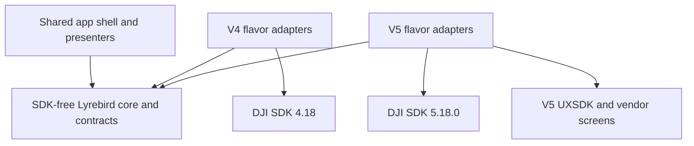

# Dual-SDK Flavor Implementation Plan

Date: 2026-09-15

Status: implementation started. V5 flavor scaffolding is in place; V4 SDK provisioning and
adapter implementation have not started.

## 1. Outcome and Scope

Build two independently installable Android apps from the same repository:

| App | Standard variant | Application ID | Purpose |
| --- | --- | --- | --- |
| Lyrebird V5 | `currentV5` | `com.lyrebird.rc` | Existing V5 aircraft support; preserves the installed app's upgrade identity |
| Lyrebird V4 | `currentV4` | `com.lyrebird.rc.v4` | Qualified aircraft supported by DJI MSDK V4 |

Both apps can be installed on the same supported phone. Only one may own an active DJI connection and Lyrebird network-server session at a time. The operator launches the appropriate app; each app detects the product and its capabilities within its own SDK family. There is no in-process SDK switching or automatic cross-app handover during flight.

The initial phone target is the same phone and Android build already used for the current Lyrebird V5 app. Record that existing baseline during qualification; do not select a different phone, add older/32-bit phones, or lower Android requirements to accommodate V4. A compatibility blocker on that baseline requires an explicit decision, not a silent change of target. The controller must still be compatible with the chosen V4 aircraft and may differ from the V5 aircraft's controller.

Preserve the existing `demoBiomass` product variant as V5 initially. It is not part of the standard two-app delivery; do not remove it or silently start distributing a third app. Enable a V4 demo variant only if separately requested.

The first release targets one explicitly qualified V4 aircraft/controller/firmware/phone combination, alongside regression-tested V5 combinations. Adding V4 does not imply that every historical DJI product, controller, Android version, or native mission feature is supported.

## 2. Corrected Planning Assumptions

- Both SDK generations support relevant phone-connected configurations; V5 is not restricted to smart controllers, and V4 also has compatible smart-controller configurations. Compatibility is a hardware/firmware/Android tuple, not simply "phone versus RC."
- The earlier AAR inspection found a duplicate bootstrap class and overlapping native-library filenames. Separate APKs avoid those collisions. A shared package prefix alone is not proof of a collision, and this plan does not depend on claiming that every possible custom-loader solution is impossible.
- V4 has a keyed interface, introduced in 4.0, as well as component APIs. Do not recreate V5's key DSL as the application's abstraction.
- V4 `FlightControlData` uses physical values according to configured modes: meters/second, meters, degrees, or degrees/second. It is not a universal normalized +/-1 interface. Axis names, signs, modes, limits, and command cadence need adapter tests and hardware confirmation.
- V4 supports native waypoint APIs on some aircraft, including different mission-operator generations. They are not the V5 KMZ/WPMZ interface. Other V4 aircraft require app-executed virtual-stick missions.
- V4's compressed video feed is not a drop-in replacement for Lyrebird's decoded frame input. Decode and normalize it before reusing the existing WebRTC and local-inference pipeline.
- DJI onboard AutoSensing and Lyrebird's local TFLite detection are separate capabilities. Local inference remains reusable on V4 once decoded frames are available.
- A stale public release does not establish an official end-of-life policy. Treat V4 maintenance, modern Android compatibility, registration, and native-library support as risks to validate, not settled guarantees.

No device registration, mixed-install test, flight test, or V4 build against Lyrebird's toolchain has been performed for this plan.

## 3. Architecture: One Application Core, Two Hardware Adapters

Use one additional SDK-free Android library, `:lyrebird-core`, plus the existing `:app` and `:uxsdk` modules. Initially keep SDK implementations in app flavor source sets; separate adapter library modules are unnecessary for this two-app scope.

Proposed layout, relative to `LyrebirdApp/`:

```text
android-sdk-v5-as/              Existing Gradle root, retained during migration
lyrebird-core/                 New shared Android library; no DJI dependencies
  src/main/                   Domain contracts, commands, control, protocols, video
  src/test/                   Shared policy, controller, protocol, and frame tests
lyrebird-app/
  src/main/                   Shared app shell, UI presenters, settings, resources
  src/v5/                     V5 bootstrap, adapters, SDK-bound screens and resources
  src/v4/                     V4 bootstrap, adapters, SDK-specific resources
  src/demoBiomass/             Existing product-specific behavior
  src/test/                   App tests that apply to both SDK flavors
  src/testV5/                 V5 adapter tests
  src/testV4/                 V4 adapter tests
android-sdk-v5-uxsdk/           Existing UXSDK; V5 dependency only
```

Dependency direction:



Each app compiles the shared source plus exactly one adapter set. A flavor-local composition factory supplies the implementations to shared code. Do not scatter `if (sdk == v4)` checks across controllers, HTTP handlers, MAVLink, or UI presenters.

### What stays shared

- Command validation, result mapping, asynchronous completion tracking, and HTTP response rendering.
- Safety authority, physical-RC override policy, command arbitration, cancellation, and mission sequencing.
- PID controllers, geometry, waypoint arrival logic, orbit logic, ROI math, and model-independent obstacle policy.
- MAVLink framing, dialect, signing, parameters, mission exchange, FTP, snapshots, and discovery/network protocols.
- Explicit HTTP/TCP telemetry serialization, logging policy, identity handling, and settings schemas.
- WHIP signaling, WebRTC peer setup, encoders, frame fan-out, metadata, frame-rate adaptation, and local TFLite inference.
- Common flight-deck state, command buttons, connection/status views, and capability-driven feature availability.

### What differs by SDK

| Boundary | V5 implementation | V4 implementation |
| --- | --- | --- |
| Bootstrap and connection | `SDKManager`, V5 callbacks and key subscriptions | `DJISDKManager`, product/component connection callbacks |
| Aircraft state | V5 keys and listeners | Component state callbacks and/or V4 KeyManager |
| Flight primitives | V5 actions and virtual-stick manager | V4 `FlightController` methods and `FlightControlData` |
| Camera, gimbal, media | V5 keys and `MediaDataCenter` | V4 `Camera`, `Gimbal`, and `MediaManager` |
| Native mission execution | WPMZ generation and V5 waypoint manager | Supported V4 waypoint operator, implemented per qualified product |
| Decoded video input | `ICameraStreamManager` | `VideoFeeder` plus `DJICodecManager` or a validated decoder alternative |
| Optional sensors/payloads | Existing V5 APIs | Product-specific V4 APIs or explicit unsupported status |
| Vendor UI | Existing UXSDK widget subtrees and sample screens | Small platform-specific views where genuinely necessary |

Do not create separate `V4DroneController` and `V5DroneController` copies of the navigation algorithms. The shared controller issues neutral commands through flight-control adapters. Likewise, do not implement a second MAVLink server or a second HTTP command policy for V4.

### Contract details

Define narrow, SDK-free contracts for telemetry, flight primitives, camera/gimbal operations, media access, native missions, decoded frames, and optional capabilities. Reuse existing `MavlinkMotionSink`, `MavlinkCommandSink`, `MavlinkMissionSink`, `CommandResult`, and `GimbalRotation` where they already express application behavior; these are not replaced by raw SDK wrappers.

Contract requirements:

- Coordinates carry an explicit altitude reference. Keep height above takeoff, home altitude, and MSL altitude distinct; unavailable MSL information must not become invented zero or RTH height.
- Motion commands name physical intent, such as forward/right/up velocity and clockwise yaw rate. Put vendor pitch/roll mapping at the adapter boundary. Preserve existing V5 behavior before considering tuning changes.
- Distinguish vertical velocity from altitude-position commands and yaw rate from heading commands. A zero position command must never accidentally be treated as a hover command.
- Telemetry includes freshness, validity, and connection generation. Late callbacks from a previous aircraft cannot update or complete operations in the next session.
- Convert SDK enums and errors into explicit domain values. Do not serialize SDK `toString()` output, class names, or enum ordinals into new contracts.
- Keep existing protocol result types and wire meanings. Model SDK acceptance separately from observed completion; cancellation and timeouts must prevent later callbacks from reporting success.
- Capability data distinguishes supported, unsupported, temporarily unavailable, and unknown states, including optional sensor validity. Keep limits and supported modes with the capability, not only a boolean.
- Decoded frames specify format, dimensions, stride/planes where needed, timestamps, buffer lifetime, and ownership. Do not assume a V4 callback is already NV21.
- Export only the contracts needed across modules. Existing Kotlin `internal` types cannot simply move into a library while app code continues accessing them; move their consumers too or deliberately expose the small boundary.
- Keep the core free of app-specific `R`, `BuildConfig`, activities, DJI types, and transitive SDK dependencies. Inject configuration and platform services.

## 4. Existing Code to Adapt

Paths below are relative links to the current sources; proposed classes and source sets do not exist yet.

| Current owner | Planned change |
| --- | --- |
| [App build configuration](../lyrebird-app/build.gradle) and [Gradle settings](settings.gradle) | Add SDK dimension, flavor dependencies, unique artifacts, and shared core |
| [FlightDeckActivity](../lyrebird-app/src/main/java/com/lyrebird/rc/FlightDeckActivity.kt) | Extract shared session ownership, telemetry aggregation, sink implementations, and presenters; isolate SDK UI integration |
| [DroneController](../lyrebird-app/src/main/java/com/lyrebird/rc/controller/DroneController.kt) | Retain shared control algorithms; replace V5 VM/key access with injected telemetry and flight ports |
| [ControlAuthority](../lyrebird-app/src/main/java/com/lyrebird/rc/controller/ControlAuthority.kt) | Preserve arbitration semantics; decouple its takeover callback from SDK-bound implementation details |
| [HTTP command host/server](../lyrebird-app/src/main/java/com/lyrebird/rc/LyrebirdHttpServer.kt) | Remove raw `DJIKey`, laser, and UXSDK detection types from shared boundaries; preserve existing responses |
| [TelemetryCoordinator](../lyrebird-app/src/main/java/com/lyrebird/rc/telemetry/TelemetryCoordinator.kt) | Use explicit neutral values with compatibility-preserving serializers |
| [Native mission helper](../lyrebird-app/src/main/java/com/lyrebird/rc/controller/WaylineMissionHelper.kt) | Keep WPMZ-specific construction/execution in V5; accept a shared mission description |
| [Mission contract/default](../lyrebird-app/src/main/java/com/lyrebird/rc/mavlink/MavlinkMissionSink.kt) | Preserve executor names; use a supported first-run V4 default without silently changing a selected executor |
| [Payload](../lyrebird-app/src/main/java/com/lyrebird/rc/controller/Payload.kt) | Separate shared capture/download workflows from SDK camera, storage, LRF, and payload actions |
| [SharedDJIFrameSource](../lyrebird-app/src/main/java/com/lyrebird/rc/webrtc/SharedDJIFrameSource.kt) | Extract SDK-free frame fan-out and processing; leave camera selection/listeners in the V5 adapter |
| [Application bootstrap](../lyrebird-app/src/main/java/com/lyrebird/rc/DJIAircraftApplication.kt) and [manifest](../lyrebird-app/src/main/AndroidManifest.xml) | Flavor-specific SDK startup, compatible USB handling, shared lifecycle policy, and merged-manifest verification |

The existing command-core direction already favors one result-producing command implementation for HTTP and MAVLink. Extend that design instead of introducing another command architecture.

## 5. Build, Identity, and Packaging

1. Keep `appVariant` as the first flavor dimension and add `sdk` second, with `v5` and `v4`. This gives `currentV5Debug`, `currentV4Debug`, and `demoBiomassV5Debug`. Disable `demoBiomassV4` initially through the supported variant API.
2. Keep V5's application ID and existing signing identity for upgrades. Give only V4 the `.v4` suffix. Distinct IDs, not distinct labels alone, make side-by-side installation possible. Manage version codes independently for the two application IDs.
3. Use recognizable V4/V5 app labels and icons. Give APKs unambiguous names such as `Lyrebird-current-v4-debug.apk` and `Lyrebird-current-v5-debug.apk`; update installers and CI artifact paths accordingly.
4. Scope V5 SDK runtime/provided dependencies and `project(':uxsdk')` to V5. Scope `com.dji:dji-sdk:4.18` and compile-only `com.dji:dji-sdk-provided:4.18` to V4. Audit transitive dependencies, manifests, resources, and native libraries, not only direct imports.
5. Keep SDK-provided artifacts compile-only and the correct runtime artifact in each APK. Never resolve cross-generation bootstrap/native conflicts with `pickFirst` or by importing both SDKs into common source.
6. Preserve current V5 key configuration. Introduce a separate V4 key setting, for example `AIRCRAFT_API_KEY_V4`, registered for `com.lyrebird.rc.v4`. Do not fall back to V5's key when V4 credentials are missing. Retain the existing V5 demo key behavior.
7. Keep secrets in machine-local configuration or CI secrets. Provision each app separately; check any package/signing restrictions on map services too. Never copy keys from RosettaDrone or commit credentials.
8. Keep Android SDK/toolchain settings and ARM64 support unchanged initially. The current app uses min SDK 24 and compile/target SDK 36. Verify V4 compatibility with this toolchain and the actual phone, including native page-size requirements; do not downgrade the shared V5 build to match an old sample project.
9. Retain `${applicationId}`-qualified provider authorities. Preferences, caches, downloaded media, backups, and runtime security state must be app-private. Audit hardcoded shared-storage paths, intent actions, and providers. Do not use a shared UID or automatically copy safety/signing credentials between apps.
10. Move SDK-dependent Java/Kotlin, layouts, view-binding inputs, navigation entries, styles, manifest activities, and sample screens out of common source. Hiding a screen at runtime does not stop its source or generated binding from requiring V5 classes.

An optional later settings export/import can transfer non-secret preferences, with capability validation and explicit confirmation. It is not needed for initial side-by-side installation.

## 6. Same-Phone Session Ownership

Separate application IDs do not isolate network ports or grant simultaneous access to the same USB accessory.

- Introduce a shared session coordinator implementation used by both APKs. Before SDK connection startup, acquire a process-held device-local exclusive lease, for example a dedicated loopback listening socket. Qualify the chosen primitive on target Android devices; acquire by binding, not by checking and then binding.
- The lease is cooperative between the Lyrebird apps, not an aircraft safety authority or an Android USB permission. It does not prevent DJI Fly/Pilot or unrelated apps from competing for the accessory.
- Keep the inactive app available for offline settings/status, but do not let it initialize a competing product connection, start control loops, publish WHIP, or bind/advertise the shared server endpoints. Report ownership/bind errors visibly instead of silently running a partial server stack.
- Audit V4 auto-started SDK services/receivers and application bootstrap so they cannot bypass connection ownership. Keep each flavor's required loader initialization separate from the decision to register/connect its SDK.
- Retain the existing public ports: MAVLink UDP 14550, HTTP 8080, telemetry TCP 8081, and discovery UDP 30000. Start endpoints transactionally; roll back partial startup and advertise only endpoints that actually started, with honest connection state.
- Handle Android's USB app chooser and remembered default explicitly. Both apps may match the same accessory filter; USB identity is not a dependable aircraft-model selector. Never promise automatic family selection before SDK initialization.
- Keep session lifetime independent of activity recreation. For sustained/background operation, validate the shared service owner and required foreground-service declarations/permissions against Android and DJI lifecycle requirements. Losing UI focus must not silently drop an active flight session.
- Normal app switching requires a safe stopped session, normally landed with confirmed state. Stop/cancel application operations, apply the validated SDK shutdown sequence, stop publishers/listeners/servers, unregister discovery, then release the lease. The second app never forcibly terminates the first.
- Process death releases the lease but does not prove the aircraft is landed or that a native mission stopped. A subsequent session reconciles aircraft state and never automatically resumes commands or takes over flight. Link-loss behavior remains an independently tested aircraft/SDK failsafe.

Preserve the existing authority model: safety takeover has no timeout, only Safety may release it, and physical RC override remains a separate latch. Activity recreation and transient SDK reconnects must not reset these policies. The current authority object is in-memory and treats process restart as a new session; this migration must not misrepresent it as cross-app persistent state or use app switching as an automatic authority release.

## 7. Capability and Mission Policy

| Capability | V5 | V4 initial release |
| --- | --- | --- |
| HTTP, MAVLink, TCP telemetry, discovery, signing, authority | Preserve current behavior | Same shared implementations |
| Takeoff, landing, RTH, virtual stick | Existing support | Adapt and qualify per target aircraft |
| Goto, yaw, altitude, orbit, ROI | Shared controller/policy | Same algorithms through V4 adapters; camera/aircraft limits apply |
| App-executed missions | Existing `ONBOARD` executor | Reuse it; do not import a second mission sequencer |
| Aircraft-native missions | Existing V5 compiler/executor | Explicitly unsupported until the relevant V4 operator adapter is qualified |
| Photo, recording, gimbal, media download | Existing support | Implement available operations; serialize mode changes and honor media-download limitations |
| Zoom, thermal, LRF, RTK, payload accessories | Existing product-specific support | Capability-gated; no generic parity promise |
| WHIP/WHEP video | Existing path | New decoded-frame adapter, same publishing/playback stack |
| Local TFLite detections | Existing local pipeline | Reuse after decoded-frame and performance qualification |
| DJI AutoSensing | Existing supported products | Unsupported unless an actual equivalent provider is verified |
| Obstacle data/guard | Existing opt-in policy | Use only verified sensors; unavailable/unknown is not "clear" |

The existing `MissionExecutor.fromPref()` defaults to `DJI_NATIVE`, despite an older nearby comment describing another default. Preserve V5's actual preference behavior. For a new V4 installation, explicitly select the shared app-executed executor until V4 native execution is implemented. Preserve the existing `onboard` and `dji_native` wire/preference values.

If a user or imported profile requests unavailable native execution, reject it with an explicit unsupported result. Never silently convert a native mission into a phone-executed mission: their link-loss, scheduling, and continuity behavior differ. Native conversion must reject unrepresentable actions, frames, speeds, or limits before execution, not drop mission items.

Expose capabilities consistently to the app, HTTP, and MAVLink. Additive capability metadata may be needed, but avoid changing the custom MAVLink dialect simply to implement flavors. Preserve current HTTP prose/JSON and TCP field formats with explicit serializers and golden fixtures; changing SDK data classes is not permission to change the public protocol.

For sensor-dependent modes, unavailable required data produces an explicit refusal or an operator-selected mode that does not claim that protection. Never disable DJI onboard avoidance or weaken safety gates merely to obtain V4 compatibility.

## 8. Implementation Sequence and Gates

Each phase should be split into reviewable changes, with focused checks immediately after each behavioral extraction. Keep V5 working throughout; do not combine controller retuning, UI redesign, and SDK replacement in one change.

### Phase 0: Qualify the Target and Toolchain

- Select the first V4 aircraft/controller/firmware, using the existing V5 phone and Android build as the fixed device baseline. Record its model, ARM ABI, and 4 KB/16 KB page size; this is validation of the current phone, not selection of a new one.
- Prove a V4 4.18 bootstrap can build with the chosen toolchain, register with its own application identity, reconnect, receive telemetry, and provide decoded video. This is a future bench spike, not a flight-control rollout.
- Verify actual virtual-stick/native-mission/camera capabilities, DJI activation or account requirements, permissions, and any conflicts with installed DJI apps.
- Use RosettaDrone as a reference for V4 API usage and test cases, not as evidence that its historical device matrix is supported by this new build.

Gate: a repeatable target-specific build and bench connection. Native-library or SDK startup incompatibility on the required phone is a blocker to resolve before a large core extraction. Re-estimate after this phase.

### Phase 1: Freeze Contracts and Extract Neutral State

- Establish the current V5 compile/unit-test baseline and record HTTP, TCP, and MAVLink behavior for representative telemetry and commands.
- Introduce neutral telemetry, identity, capabilities, optional-sensor, and detection types. Replace SDK value leakage at protocol boundaries while preserving serialized output.
- Reuse `CommandResult` and the existing motion/command/mission contracts. Introduce only the lower-level SDK ports needed for the next vertical slice.
- Start with V5 telemetry through the new types to the existing clients; verify timestamps, altitude references, battery units, and missing-data behavior.

Gate: current V5 behavior and wire fixtures remain unchanged, and boundary DTOs have no DJI imports. No V4 behavior is enabled yet.

### Phase 2: Extract Shared Command and Control Code Behind V5 Adapters

- Adapt V5 telemetry, virtual-stick modes/send operations, takeoff/land/RTH, and flight limits to the new ports.
- Keep one `DroneController` implementation for all loops, sequencers, session IDs, arrival latches, cancellation, RC override, and safety takeover. Preserve existing V5 axis behavior and timing.
- Extract SDK-free camera/media workflows and command-sink implementations from the activity. Keep WPMZ compilation in a V5 native-mission implementation.
- Move cohesive SDK-free slices and their tests into `:lyrebird-core`. Resolve Kotlin visibility, Android resource ownership, lifecycle dependencies, and callbacks deliberately.
- Route UI, HTTP, MAVLink, and app-executed missions through the same authorization/command policy. Low-level SDK adapters must not become alternate command entry points.

Gate: V5 compiles and passes the focused controller, safety, protocol, ROI, and media tests; V5 simulator/bench behavior matches baseline. The core builds without either DJI SDK on its classpath.

### Phase 3: Introduce Flavors and Isolate SDK-Bound UI

- Add the SDK dimension, V4 identity/key configuration, flavor composition factories, dependencies, manifests, artifact names, and variant-aware build/install tooling.
- Move remaining V5-only sources/resources into `src/v5`, preserving package names where practical. Retain vendor/sample features there; do not delete them just to make V4 compile.
- Extract a common flight-deck shell and presenter from the activity. Isolate V5 widget subtrees behind small view integration points; use shared neutral status/controls and video presentation for V4. Do not copy the whole activity or import the entire V4 UXSDK merely for one widget.
- Add the shared session-ownership/startup/shutdown policy before simultaneous installed-app connection tests. Provide an honest disconnected/bootstrap state for V4, not successful no-op SDK implementations.

Gate: both APKs compile and install together on the target phone with distinct identities. V5 remains operational. V4 runtime contains no V5 SDK/UXSDK artifacts; V5 runtime contains no V4 SDK. The inactive app cannot start competing endpoints or a product connection.

### Phase 4: Implement V4 Telemetry, Flight, Camera, and Media Adapters

- Normalize V4 component/key callbacks into the shared snapshot and reconnect model. Subscribe once per component and fan out neutral state; avoid consumers replacing each other's single SDK callbacks.
- Implement supported flight primitives and mode transitions. Configure modes before sending, use bounded/cancellable retries, and obey V4's documented 5-25 Hz virtual-stick send cadence. Keep controller computation and command refresh rates distinct if needed.
- Add pure conversion tests for forward/right/up, yaw, ground/body transformations, altitude mode, limits, and manual-stick scaling. Validate each axis on simulator/hardware before autonomous paths.
- Feed physical RC state and SDK authority changes into Lyrebird's existing override policy. A late callback, retry, or reconnect cannot re-enable motion after cancellation or takeover.
- Implement supported camera/gimbal/media operations, including asynchronous mode-change ordering, recording transitions, download-mode effects on preview, and reliable capture-to-file identification.
- Enable the shared app-executed mission path with the explicit V4 default. Keep unavailable capabilities and native execution visibly unsupported.

Gate: supported commands have the same HTTP/MAVLink outcomes and safety behavior on V4; unsupported commands fail honestly. Controlled takeoff, landing, RTH, directional motion, cancellation, takeover, and RC override are separately signed off on the target tuple.

### Phase 5: Implement V4 Video and Reuse Local Inference

- Extract the shared frame consumer/fan-out layer from `SharedDJIFrameSource`; keep V5 camera selection and listeners flavor-local.
- Implement V4 compressed-feed acquisition and decoding, then adapt actual callback format/stride to the common decoded-frame contract. Verify timestamp monotonicity, buffer ownership, rotation, and source-size changes.
- Reuse the current WebRTC encoder/peer/WHIP path, metrics, adaptive frame rate, and MediaMTX integration. Keep the optional V5 surface encoder V5-specific.
- Reuse local TFLite inference with neutral detection types. Tune resolution, inference cadence, and frame dropping from measurements on the target phone, independently of the control thread.
- Test decoder teardown, feed reconnection, recording/photo transitions, and consumer removal while frames are in flight.

Gate: visible preview and WHIP-to-MediaMTX-to-WHEP playback on both apps, stable reconnects, and an agreed-duration bench soak with latency/load recorded. Video or inference stalls cannot starve flight commands. Do not add a direct WebSocket-signaling viewer or a second public RTP-only video path.

### Phase 6: Add V4 Native Missions Where Required

This is a separately scoped milestone, not a prerequisite for V4 models that only support app-executed missions.

- Reuse the shared mission storage, MAVLink exchange, validation, and progress contract. Compile the neutral mission into the operator supported by the target aircraft, rather than trying to upload V5 KMZ files.
- Define an explicit supported subset for actions, headings, speeds, waypoint counts, altitude frames, finish behavior, and link-loss behavior. Add a separate V4 operator-generation adapter only when a target product needs it.
- Preserve original mission item indices through compilation so acknowledgments, progress, restart/current-item behavior, and downloads agree with the shared mission model.
- Test upload acceptance versus execution readiness, errors, start/pause/resume/stop, reconnection, safety takeover, and unsupported mission rejection. Never infer completion solely from a successful SDK method callback.

Gate: native execution is advertised only for qualified combinations and representable plans. V5 native mission behavior is unchanged; app-executed missions remain a separate explicit choice.

### Phase 7: Qualify and Release the Two Apps

- Exercise cold start, USB attached before launch, detach/reconnect, activity recreation, screen lock/background behavior, port conflicts, process death, and wrong-app selection with both APKs installed.
- Verify separate preferences, credentials, files, provider authorities, versioning, and V5 upgrade continuity. Test both app launch orders and normal handover while safely grounded.
- Use the GroundStation dashboard to compare MAVLink telemetry/commands against HTTP on both backends. Include missing values, units, cancellation, photo/download, mission progress, and negative/unauthorized cases.
- Run the relevant Python regression suite and existing Android quality gates. Update quality scopes for the new core/flavor roots, CI tasks, manual pre-commit hooks, and installer variant names.
- Publish two clearly named standard artifacts, supported-device/capability matrices, installation/USB-default instructions, and rollback steps. Keep V5 demo builds available separately.

Gate: the acceptance checklist below is complete for each claimed target. A successful build or a historical RosettaDrone support claim is not a substitute for this qualification.

## 9. Verification and Acceptance

Reuse existing controller, ROI, MAVLink signing/mission/FTP/message, and frame-metadata tests. Move shared tests with shared code and parameterize adapter contract tests where practical. Add small fakes for the hardware ports and clock rather than requiring JNI initialization in unit tests.

Required regression cases include:

- Identical neutral commands produce equivalent physical intent in both adapters, including heading wrap, downward/upward signs, altitude references, ignored axes, and limits.
- A disable/cancel operation can never retry as enable; a timed-out or superseded operation cannot finish a later command.
- Safety takeover stays latched without a timeout, Pilot cannot release it, and reconnect/UI recreation cannot bypass it. Physical RC override remains independently enforced.
- Stale/disconnected telemetry and unavailable obstacle data are not reported as valid position or clear space. Unknown flight state blocks unsafe automatic transitions.
- HTTP/TCP compatibility fixtures and decoded MAVLink values agree, including errors and unsupported features. Do not blindly compare packets containing variable sequence numbers/timestamps.
- Requested native missions never silently become app-executed missions. Unsupported items do not produce accepted/executed status.
- Frame callbacks cannot outlive disposed consumers; repeated start/stop/reconnect remains stable with video and inference enabled.

Representative future Gradle gates, run from this directory after the variants/modules exist:

```bash
./gradlew :lyrebird-core:testDebugUnitTest
./gradlew :app:compileCurrentV5DebugKotlin :app:testCurrentV5DebugUnitTest
./gradlew :app:compileCurrentV4DebugKotlin :app:testCurrentV4DebugUnitTest
./gradlew :app:assembleCurrentV5Debug :app:assembleCurrentV4Debug
./gradlew :app:assembleDemoBiomassV5Debug
```

Also configure and run Spotless, Detekt/Lint, and release-variant build checks for the new source roots. Inspect both resolved runtime classpaths and merged manifests/APKs. From the repository root, run `python -m pytest GroundStation/tests -q` and the applicable Python quality gates when shared client contracts are touched.

Release acceptance:

- [ ] V4 and V5 standard apps install together and have distinct labels/IDs; V5 upgrades preserve its identity and settings.
- [ ] Shared core contains no DJI dependency; each APK contains only its selected SDK generation.
- [ ] Common control/protocol/video-processing implementations are shared, not duplicated across flavors.
- [ ] Only one app owns the live connection/server session; both launch orders, failure cleanup, and safe handover pass.
- [ ] Each advertised V4 feature has passed the relevant target-specific test; missing features fail explicitly.
- [ ] Existing V5 flight, native missions, payloads, media, video, and demo build show no unintended regression.
- [ ] Physical RC override, Safety takeover, link loss, cancellation, and background/process-death behavior are documented and tested.
- [ ] Existing GroundStation clients interoperate with both apps; WHIP/WHEP remains the public video path.
- [ ] Upstream notices and SDK distribution requirements have been reviewed for any imported code/binaries.
- [ ] CI, installation tooling, support matrix, operator instructions, and rollback artifacts cover both apps.

## 10. How RosettaDrone Helps

Reference revision: `805ca9e4525e3ae741877cf912883cd6e85e5478` of [RosettaDrone](https://github.com/RosettaDrone/rosettadrone/tree/805ca9e4525e3ae741877cf912883cd6e85e5478). This is a reference implementation, not a new Lyrebird dependency or a replacement application base.

| Verified reference | Use in this plan | Do not inherit automatically |
| --- | --- | --- |
| [Build configuration](https://github.com/RosettaDrone/rosettadrone/blob/805ca9e4525e3ae741877cf912883cd6e85e5478/app/build.gradle) uses MSDK 4.16.4 and UXSDK 4.16 | Confirm V4 lineage and identify dependency/packaging considerations | Its old Android toolchain, bundled native code, UXSDK, or SDK version pin |
| [DroneModel](https://github.com/RosettaDrone/rosettadrone/blob/805ca9e4525e3ae741877cf912883cd6e85e5478/app/src/main/java/sq/rogue/rosettadrone/DroneModel.java) uses V4 flight, battery, RC, camera, and media APIs | Find callback lifecycles, mode setup, physical-value mapping, and model-specific test cases | Its mixed UI/SDK/MAVLink ownership, controller gains, telemetry approximations, or safety policy |
| [MissionManager](https://github.com/RosettaDrone/rosettadrone/blob/805ca9e4525e3ae741877cf912883cd6e85e5478/app/src/main/java/sq/rogue/rosettadrone/MissionManager.java) sequences MAVLink missions via virtual sticks | Support the decision to reuse Lyrebird's app-executed missions on V4 models lacking native waypoints | A second sequencer or its unsupported-action handling |
| [README](https://github.com/RosettaDrone/rosettadrone/blob/805ca9e4525e3ae741877cf912883cd6e85e5478/README.md) documents historical Mini/Mavic/Air/M210 V2 tests and QGC UDP video | Suggest representative bench scenarios and camera/feed compatibility checks | A current compatibility guarantee or an alternative to Lyrebird's WHIP/WHEP path |

Concrete reasons for reference-first reuse:

- `DroneModel` documents a 50 ms virtual-stick period, consistent with V4's documented 5-25 Hz window. This is useful evidence for adapter cadence, not a reason to copy its PID loops.
- Its RC override path uses a five-second MAVLink suppression interval. Lyrebird's latched override/authority policies must remain authoritative.
- Its `setVirtualSticksEnabled` error path retries with `true`, even when the original request was to disable. Do not transplant this behavior; use it as a cancellation-regression test case.
- Camera recording and media-download workarounds are useful qualification leads. Verify them against SDK 4.18 and the selected firmware, and use bounded asynchronous sequencing rather than importing blocking waits or unbounded retries.
- Its README's QGC video workflow is UDP/RTP. A WebRTC library dependency does not establish compatibility with Lyrebird's WHIP publisher.

### License handling

RosettaDrone's top-level [license](https://github.com/RosettaDrone/rosettadrone/blob/805ca9e4525e3ae741877cf912883cd6e85e5478/LICENSE) is BSD-3-Clause, with government-contribution context in [INTENT.md](https://github.com/RosettaDrone/rosettadrone/blob/805ca9e4525e3ae741877cf912883cd6e85e5478/INTENT.md). Its README identifies additional MIT decoder-sample and Apache-2.0 streaming origins. Check the notices of each actual file/dependency before importing it; the top-level license does not replace those notices.

Lyrebird's current [license](../../LICENSE) is Business Source License 1.1 with a future MIT change license. Preserve applicable upstream source/binary notices and modification notices, and do not imply that imported upstream code becomes exclusively Lyrebird-licensed. This plan recommends API/behavior references first; any literal code reuse needs a scoped provenance and license review. No RosettaDrone code is imported by this document.

## 11. Effort and Decisions Before Implementation

Planning range for one Android/DJI engineer with timely access to the required hardware: approximately 8-13 engineer-weeks for shared-core extraction, two apps, one qualified V4 target, shared app-executed missions, media/video, and V5 regression work. This is an estimate, not a commitment. Native V4 mission support, additional aircraft families, older 32-bit phones, or decoder/platform incompatibilities add separate work and qualification time.

RosettaDrone reduces API-discovery effort and supplies test scenarios; it does not remove Lyrebird's extraction, safety, video, or hardware-validation work. Re-estimate after Phase 0 instead of treating the earlier feasibility estimate as a fixed schedule.

Inputs to settle before implementation starts:

1. First V4 aircraft model, controller, and firmware. Record the existing V5 phone/Android baseline and use that same phone for V4 qualification and V5 regression; the phone target is already decided.
2. Whether V4 native aircraft missions are required for the first delivery or may follow app-executed missions.
3. Required V4 camera/media/optional-payload features and acceptable video/latency/soak targets.
4. Distribution route, signing ownership, and separate application-key provisioning for V4.

Recommended first implementation change after the bench spike: a V5-only telemetry/command-contract extraction with compatibility tests. It creates the shared foundation without mixing the initial refactor with unverified V4 flight behavior.

## Reference Documentation

- [Android build variants and source sets](https://developer.android.com/build/build-variants).
- [DJI V4 keyed interface](https://github.com/dji-sdk/Mobile-SDK-Android/blob/master/docs/README-KeyedInterface.md).
- [DJI V4 flight-controller API, including virtual-stick cadence](https://developer.dji.com/api-reference/android-api/Components/FlightController/DJIFlightController.html).
- [DJI V4 FlightControlData units](https://developer.dji.com/api-reference/android-api/Components/FlightController/DJIFlightController_DJIVirtualStickFlightControlData.html).
- [DJI V4 decoder API](https://developer.dji.com/api-reference/android-api/Components/CodecManager/DJICodecManager.html).
- [DJI V5 release notes and supported aircraft/controller combinations](https://developer.dji.com/doc/mobile-sdk-tutorial/en/).
