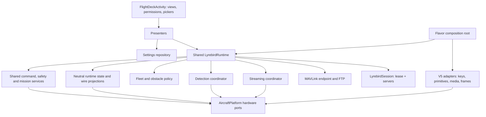

# Flight Deck Decomposition Plan

Date: 2026-09-15
Reviewed: 2026-09-18.
Status: partial implementation on `feature/dual-sdk-implementation`. Several extraction batches
are committed and further V5 source relocations are staged. The activity-independent runtime
and SDK-neutral platform bridge remain incomplete.

## Readiness Correction

The earlier completion descriptions overstated the result. Moving a class into `src/v5` or
keeping its instance in a process registry does not make application behavior SDK-neutral or
independent of the screen. In the current worktree, `FlightDeckActivity.onDestroy()` still stops
detection and ends flight logging; its flight-state observer updates controller state and
detects RC-triggered RTH. Network and MAVLink runtimes still obtain behavior through replaceable
activity bindings. These are remaining implementation tasks, not only device-test gates.

Continue with the `AircraftPlatform` bridge and shared runtime described in
[DUAL_SDK_FLAVORS_PLAN.md](DUAL_SDK_FLAVORS_PLAN.md#architecture-decision). Preserve the source
relocations, but prioritize one end-to-end V5 telemetry/command path through that boundary over
further broad file moves. Do not duplicate FlightDeck, control loops, or mission sequencing for
V4 or a hypothetical SDK 6.

## Implementation Checkpoint

The original measurements and region map below describe the starting revision, not the current
line numbers. Progress is tracked by responsibility and validation, not by lines removed.

| Step | Current implementation | Verification still required |
| --- | --- | --- |
| 0 | App Spotless now receives an explicit source-rooted `FileTree`; previously omitted packages are covered. The duplicate app MAVLink protocol was removed. | Live HTTP/TCP/MAVLink bench fixtures. |
| 1 | `LyrebirdSettings` owns typed preferences, validators, and the unchanged per-aircraft key set. `SettingsSnapshot` owns settings JSON; `StreamingMode` retains its original package in a separate file. | Live settings comparison. SDK effects and MAVLink parameter dispatch remain in their existing callers. |
| 2 | `SettingsDialogViews` owns dialog rendering; `FlightDeckSettingsPages` uses SDK-free `SettingsPageActions` and `FlightSettingsActions`. Display labels and settings JSON have regression tests. | Manual navigation through every settings page and dialog, including dismiss/recreation. |
| 3 | `DeviceStatusSource` owns application-context sensor/location subscriptions and a weak location listener. `DeviceStatusSnapshot` feeds the existing wire fields. Permissions remain in the activity; streaming Wi-Fi lock ownership is now process-scoped. | Sensor/permission checks and LeakCanary on the target device. |
| 4 | Neutral readings/state and V5 subscription code exist; the process registry owns the source and a connection listener. | Finish the neutral observable telemetry port and one runtime state store. Flight-state business effects still live in an activity observer, which detach clears. Cache defaults/envelope timestamps do not establish per-field validity. |
| 5 | HTTP exposes neutral application ports; V5 payload/camera, motion and mission sink classes are extracted. | Split shared command/controller/onboard-sequencer policy from SDK primitives. V5 hosts still expose keys/VMs or concrete telemetry; shared `ControlAuthority` directly calls the V5-local controller. Add conformance tests and safety review. |
| 6 | Policy helpers and process-retained WebRTC/native publishers exist. | Runtime-owned settings, targets, metrics and explicit restart semantics still need separation from activity callbacks. Add a decoded-frame port and optional native-streaming adapter; keep WHIP and its consumers shared. |
| 7 | Process detection registry and provider classes exist. | Activity teardown still stops detection; startup/configuration needs an activity binding and inference uses UXSDK targets. Share coordination/neutral detections, preserve provider/frame ownership without UI, and keep only messages/pickers/overlay rendering on screen. |
| 8 | Process registries retain many sockets, sources, VMs and workers; a lease gates application SDK startup and network startup checks its serving state. | Build one runtime-owned dependency graph over `AircraftPlatform`. Required command/telemetry/safety/obstacle providers must not be weak activity callbacks. Implement/verify gated initialization, stale-detach handling, logging lifetime, safe explicit stop and lease-last teardown across all owners. |
| 9 | `FlightDeckActivity` and V5 bootstrap are under `src/v5`; additional V5 relocations are staged. `sdk` flavors exist, V4 is disabled. | A current Gradle edit adds `src/v5/java` back to `main`; V5 manifest/resources and indirect dependencies still need isolation. Implement shared presenter/composition, retain V5 view integration, and qualify the real V4 dependencies rather than treating cache absence as a blocker. |

Previously recorded implementation checks include Android unit tests, Spotless, and V5 debug
assembly (earlier checkpoints used the pre-flavor task names). The settings regression pins the
representative JSON bytes; telemetry tests compare units, axes, defaults, and preservation of
session authority/progress across projections. No connected Android device was available for UI,
SDK, flight, or streaming qualification. A green build is not a completed bench gate.

Historical suite results were 241 app tests, 81 core tests, and 138 Python tests. They are not
new evidence of a platform bridge or no-UI runtime; this documentation review does not rerun
Android/Python or device tests. The reviewed activity has 3,925 lines, down from 7,665. Current
V5 variants are `currentV5` and `demoBiomassV5`; V4 remains disabled pending implementation and
qualification, not just SDK cache population.
`qualityLyrebird` generated reports with non-blocking findings; Android Lint reported no errors
in the new extracted files. Style/localization findings remain, including those carried with
the existing UI code. These are not being represented as clean static-analysis reports.

Since that checkpoint, the branch has also landed:

- neutral HTTP media/detection/LRF/flight ports, with no DJI/ViewModel/UXSDK/DroneController
  imports or direct controller calls remaining in `LyrebirdHttpServer.kt`;
- V5 media, detection, MAVLink payload/camera, motion, and mission adapters;
- pure MAVLink flight policy, WHIP target/endpoint policies, detection telemetry projection, and
  V5 WebRTC construction policies;
- blocked-network startup handling and a process-scoped lease gate in application SDK startup.
  Full connection-capable initialization and coordinated shutdown across registries remain to be
  verified, including the V5 helper installed in `attachBaseContext()`.

The extracted adapters and process owners are not proof of device-qualified activity-independent
operation. Activity recreation, background operation, process death, USB chooser behavior, and
physical flight/video qualification remain open device gates.

The formatting scope repair exposed 53 files with existing violations. Most changes outside the
extracted components are formatter output; small comment-placement fixes and controller naming
suppressions preserve behavior. The original interpolated-glob target was still vacuous, even
after adding packages; the explicit `FileTree` was verified by a failing check on those sources.

Do not treat the value snapshot as timestamped sensor evidence. `AircraftReadings` deliberately
preserves legacy wire fallback values and does not claim that independently sampled SDK cache
entries were observed simultaneously. Freshness/generation changes need their own tests and
review before they affect command acceptance or reconnect behavior.

## 1. Purpose and Scope

This document records the FlightDeck decomposition and its remaining work. The authoritative
architecture and next batch order are now in
[DUAL_SDK_FLAVORS_PLAN.md](DUAL_SDK_FLAVORS_PLAN.md#8-bridge-first-implementation-batches).
[FlightDeckActivity](../lyrebird-app/src/v5/java/com/lyrebird/rc/FlightDeckActivity.kt) is smaller,
but still supplies runtime behavior as well as the screen. The bridge review in that plan maps
the current owners to concrete missing boundaries.

Goal: reduce the activity to a **view and lifecycle adapter**, and move application behavior into
named components with explicit ownership — *without* changing observable behavior, the HTTP/MAVLink
wire surfaces, or any safety policy.

The original 2026-09-15 pre-step excluded flavor implementation. The SDK dimension now exists;
V4 hardware implementation remains in the bridge/flavor plan. Do not defer `DroneController`,
`Payload`, mission or frame-consumer separation merely because the files have moved to `src/v5`:
their shared policy must consume neutral ports before a second backend can reuse it.

Non-goals:

- No new V4 SDK implementation in this documentation review; no speculative V6 API or source set.
- No wire-format change on HTTP, TCP telemetry, or MAVLink.
- No change to authority semantics, the RC-override latch, or the per-aircraft Safety persistence.
- No re-introduction of removed mock/phone video or mock telemetry.
- No controller retuning, UI redesign, or mission-executor behavior change.

## 2. Original Baseline

Measured at `fb394dc` (`feature/dual-sdk-implementation`), worktree clean.

| Fact | Value |
| --- | --- |
| `FlightDeckActivity.kt` size | **7,665 lines** — largest tracked source file in the repository |
| Next largest app Kotlin source | `DroneController.kt`, 2,033 lines |
| Member declarations in the activity | 378 |
| `findViewById` call sites | 43 |
| `sharedPreferences` references | 113 |
| `DJIKey` / `KeyManager` references | 67 |
| `KeyManager.getInstance().listen` call sites | 19 |
| App module Kotlin total | ~50,000 lines including tests and inherited DJI sample code |
| `:lyrebird-core` | ~5,600 lines of main source, already SDK-free (`mavlink/`, `telemetry/`) |

Line numbers below will drift as steps land. Treat them as region markers for locating code, not as
addresses to paste into a script.

## 3. Why This Matters More Than Line Count

The findings and line numbers in sections 2-4 describe the original `fb394dc` baseline. Some
have been repaired; use the current checkpoint and bridge audit above to identify what remains.

Three findings from the review drive the ordering:

1. **Screen lifetime and runtime lifetime are the same object.** `onDestroy` (5035-5129) stops the
   session, MAVLink endpoint, streaming, executors, fleet mesh, obstacle guard, SDK listeners, and
   `DroneController`. Any "extraction" that keeps a reference to the activity preserves this
   coupling; the fix is ownership, not file size.
2. **The recent session extraction is narrower than the plan assumed.** `startServers()` (4899-5006)
   takes the lease and binds HTTP/telemetry, but then unconditionally continues into fleet mesh,
   obstacle guard, MAVLink, and streamer creation — so a session blocked by the other APK still
   starts everything else. SDK initialization happens earlier still, in
  `DJIApplication.onCreate`,
   before any lease exists. On the way out, the lease is released inside `session.stop()` *before*
   streaming, MAVLink, and controller teardown finish.
3. **The protocol boundary still carries V5 types.** `LyrebirdCommandHost`
  (`LyrebirdHttpServer.kt` in the starting revision)
   exposes `DJIKey`, `MediaVM`, `PayloadWidgetVM`, `LocationCoordinate3D`, and UXSDK
   `DetectedTarget`. The HTTP surface cannot be shared with a second SDK until these become neutral
   operations.

Two additional defects were found while inventorying, and belong to Step 0:

- **A stale duplicate shadows core.** `lyrebird-app/src/main/java/com/lyrebird/rc/mavlink/MavlinkProtocol.kt`
  (511 lines) duplicates `lyrebird-core/.../mavlink/MavlinkProtocol.kt`. They differ only in
  visibility modifiers, member order for two constants, and formatting. Because both declare
  `package com.lyrebird.rc.mavlink`, the app's `internal object Mav` wins inside the app module, so
  the activity's `Mav.CMD_*` references resolve to the **copy in the app**, not to core. Nothing
  else in the app references it.
- **The Spotless/Detekt include list does not cover several Lyrebird-owned packages.**
  `lyrebirdSourceIncludes` (build.gradle, lines 43-53) covers `controller/`, `edge/`, `formation/`,
  `logger/`, `server/`, `webrtc/`, plus three root files. Missing: `fleet/`, `perception/`,
  `settings/`, `telemetry/`, and `mavlink/`. New packages created by this plan would be **silently
  ungated** unless the list is extended in the same commit — the same class of vacuous gate that was
  already repaired once for `:app` and `:lyrebird-core`.

## 4. Region Map

Sections in the starting revision. Region markers came from its `// ====` banners; these are
not a claim that the current activity still contains every listed block.

| Lines | Region | Target owner |
| --- | --- | --- |
| 178-431 | `StreamingMode`, `StreamResolutionPreset`, `DetectionSource`, ~120 pref/param constants | Settings (shared), parameter names stay with the MAVLink surface |
| 433-597 | Runtime fields: view models, session, MAVLink, executors, streamer, phone services | Runtime owner; device status source |
| 598-782 | Detection fields, `DataProcessor`s, ~30 DJI keys, idle detection | Aircraft telemetry adapter (keys), detection coordinator |
| 783-934 | Loading overlay; `onCreate` startup sequence | Activity (overlay), runtime owner (startup) |
| 935-1029 | Manual override checkbox; authority banner | Presenter; shared authority wiring |
| 1031-1225 | WebRTC options; streaming/RTSP/RTMP/Agora/GB prefs; edge model file selection | Settings repository; streaming coordinator |
| 1227-1483 | Map expand; action-row adapter; edge label discovery and file pickers | UI presenter; activity file pickers |
| 1484-1794 | M400 PORT_3 gimbal rebinding, thermal arming, settings JSON, `set*` validators, thermal read | V5 aircraft adapter; settings repository |
| 1796-1945 | Connection listener, detected-profile handling, metrics view | Runtime owner; UI presenter |
| 1946-2269 | WebRTC metrics JSON, Wi-Fi lock, active streaming start/stop, per-client streaming | Streaming coordinator |
| 2271-2730 | AutoSensing toggle; edge-detection toggle | Detection coordinator (+ V5 onboard adapter) |
| 2732-2798 | Drone status view | UI presenter |
| 2800-2890 | Settings backup, DJI flight-log sync, altitude/MAVLink status views, name display | Settings/lifecycle helpers; UI presenter |
| 2892-3930 | Settings cockpit and branded subpages (~1,000 lines) | Settings UI presenters |
| 3930-4018 | Key listeners: battery/RTH, storage, flight state, RTH mode override | Aircraft telemetry adapter |
| 4019-4154 | Idle monitor; loading overlay; telemetry listeners | Runtime owner; telemetry adapter |
| 4155-4248 | Drone name load/default and dialog | Settings; UI |
| 4249-4660 | Config dialogs (MediaMTX, FPS, resolution, stream, RTMP, RTSP, Agora, GB28181, confidence, format) | Settings UI |
| 4662-4818 | Default camera recording, storage status and format | V5 camera adapter |
| 4819-4898 | WHIP URL construction; location/sensor updates | Streaming coordinator; device status source |
| 4899-5034 | `startServers`, telemetry server wiring, server info toast | Runtime owner |
| 5035-5153 | `onDestroy`, `onPause`, `onResume`, HSI detach | Runtime owner + activity |
| 5154-5262 | Options menu; `fetchDroneSerialNumber` | UI; V5 identity adapter |
| 5263-5560 | Telemetry accessors, ROI tracking loop, `rebuildTelemetryCache` | V5 telemetry adapter; shared ROI control |
| 5563-5903 | MAVLink config/params, fleet mesh, obstacle guard, fleet beacon | Runtime owner; shared |
| 5904-6456 | MAVLink snapshot, parameter writes, `mavlinkParameters`, command sink | Command layer; V5 camera/gimbal ops |
| 6457-6543 | `awaitAction`, `mavlinkFlightGate`, `supersedeMission` | Shared policy; V5 action runner |
| 6544-6920 | Motion sink; `climbAfterTakeoff` | Shared sink; V5 flight ops |
| 6955-7469 | Mission sink: native WPMZ path and app-executed sequencer | Shared sequencer; V5 native-mission compiler |
| 7470-7550 | MAVLink endpoint start/restart | Runtime owner |
| 7550-7665 | `rebuildRealTelemetryCache` | V5 telemetry adapter |

## 5. Target Architecture

Target, not current completion status. The facade groups narrow hardware ports; it does not
absorb policy or duplicate the existing protocol-facing command interfaces. Contract semantics,
SDK differences and tradeoffs are specified in the
[bridge plan](DUAL_SDK_FLAVORS_PLAN.md#3-architecture-one-runtime-one-platform-facade).



The activity should keep view binding, menu/dialog presentation, permission/file-picker results,
lifecycle callbacks, and forwarding user intent to presenters. SDK-owned widget wiring can stay
in the V5 view shell. It must not supply the command backend, critical flight-state/identity
effects, worker lifetime, mission sequencing or sensor subscriptions needed without a screen.

### Ownership rules (hard constraints)

- **No session-scoped component retains the activity.** Use application context for platform
  services and detachable observers for UI notifications. Dialog renderers are explicitly
  activity-scoped and may use the themed activity context; dismiss them at screen destruction.
  A narrow interface alone does not remove a reference to an activity implementing it.
- **Components are testable without an aircraft.** Anything holding SDK types stays in the adapter
  layer, and anything with logic moves to a pure class with an existing test style (`RoiControl`,
  `DistanceTrigger`, `AuthorityLatch`, `ObstacleBrake`).
- **UI observes runtime state.** Permanent telemetry/safety/command consumers belong to the
  runtime; disposable UI observers only render. A weak activity callback is not an adequate source
  of live settings, motion, media or telemetry. Recreating the screen must not stop those consumers.
- **A facade is composition, not another service locator.** Inject the appropriate platform port
  into each coordinator/controller. Preserve registry shims temporarily, with a single instance
  owner and explicit stop path, rather than adding a new singleton for each extracted feature.
- **SDK and lease lifetime stay independent of the screen.** A blocked session must start nothing
  else; a recreation must not drop a live session; process death releases the lease but never
  resumes a mission.
- **Behavior-preserving means observable-preserving.** HTTP responses, TCP telemetry frames,
  MAVLink messages, settings JSON, and logged outcomes must be identical after each step.

## 6. Steps

The original steps remain useful as responsibility-specific acceptance criteria. Their current
status is the checkpoint table, not their presence in this list. Execute the remaining work in
bridge-plan batches B0-B7; keep V5 working, and separate mechanical moves from semantic changes.

### Step 0 — Baseline, gate repair, duplicate removal

- Extend `lyrebirdSourceIncludes` in `LyrebirdApp/android-sdk-v5-as/build.gradle` to cover
  `com/lyrebird/rc/fleet/**`, `com/lyrebird/rc/perception/**`, `com/lyrebird/rc/settings/**`,
  `com/lyrebird/rc/telemetry/**`, and `com/lyrebird/rc/mavlink/**`.
- Prove the extended gate is real, not vacuous: add a deliberate ktlint violation to a file in each
  newly covered package, confirm the check fails, then revert. (The vacuous-gate failure was already
  caught once by exactly this probe; do not skip it.)
- Delete the app-side duplicate `mavlink/MavlinkProtocol.kt` and confirm the app still compiles
  against core's public `Mav`, `MavlinkMsgId`, `PayloadWriter`, and `MavlinkFramer`. Run Spotless on
  the resulting app sources.
- Record baseline behavior for comparison: `GET /config` and `GET /config/settings` bodies, one full
  and one gap telemetry frame, and a MAVLink heartbeat plus `LYREBIRD_STATUS` at the bench. Store
  the frames as test fixtures where a fixture does not already exist.

Gate: `:app` and `:lyrebird-core` compile and pass unit tests; Spotless passes on both; the probe
demonstrated the gate fails when violated; fixtures captured.

### Step 1 — Settings repository

Move settings *state*, leaving dialogs where they are.

- New `settings/` types: a `SettingsStore` interface over `SharedPreferences`, a typed
  `LyrebirdSettings` facade (streaming, resolution, FPS, detection, MediaMTX, RTSP/RTMP/Agora/GB
  endpoints, drone name, MAVLink system id and flight-allowed flag), and the JSON serializer for
  `/config/settings`.
- Sources: preference constants (196-400), all `PREF_*` getter/setter pairs (1031-1225), the
  `set*` validators (1684-1763), `readSettingsJson` (1623-1683), and the writable-parameter
  allowlist mapping in `applyMavlinkParameter` (6009-6092).
- Keep `DroneSettingsProfiles`, `LyrebirdSettingsBackup`, and `LyrebirdOnboarding` as they are; they
  consume the same keys and must keep working. `PER_DRONE_PROFILE_KEYS` moves next to the
  repository.

Tests: extend `DroneSettingsProfilesTest`; add `LyrebirdSettingsTest` covering defaults, validation
rejections, JSON key/group shape, and the system-id resolution edge cases (unknown serial, manual
id).

Gate: `/config/settings` and `/config` bodies unchanged against the Step 0 fixtures; the `set*`
methods return the same booleans for the same inputs.

Risk: low for behavior, moderate for volume (113 call sites). Mechanical and compiler-verified.

### Step 2 — Settings UI presenters

The single largest line reduction (~1,500 lines), and the safest kind: presentation only.

- Split the cockpit page (2892-3240), branded subpages (3240-3930), the config dialogs (4189-4660),
  the options menu (5154-5205), and the name/status displays (2860-2890).
- Introduce a `SettingsScreenHost` describing what the presenters may do to the screen (show a page,
  show a subpage, show a dialog, close), and a small row/cell model so section and row construction
  is pure and testable.
- The activity keeps inflation, view lookup, and the dialog lifecycle it already tracks through
  `lyrebirdSettingsDialog`.

Tests: new presenter tests for section/row composition and value formatting (`formatCockpitLimit`,
`formatCapacity`, `formatDuration`, storage summaries). Manual UI pass for each page.

Gate: every page, value, toggle, and overflow action behaves identically; no dialogs lost.

### Step 3 — Device status source

Phone location, heading, pressure, battery, and Wi-Fi are real device readings and stay.

- `DeviceStatusSource` owns `LocationManager`, `SensorManager`, `BatteryManager`, Wi-Fi status
  and orientation math (original regions 516-595, 4849-4898, 5551-5560). Discovery/fleet multicast
  locks belong to their socket owners; the streaming Wi-Fi lock belongs to streaming lifetime.
- Expose a snapshot plus a change callback; keep the `WeakReference` listener pattern for location,
  and keep the application-context choice — both exist to prevent the ~7.8 MB activity leak.

Tests: orientation/azimuth math extracted as a pure function and unit tested. Manual: telemetry
`phoneLocation` unchanged.

Gate: the phone block of the telemetry frame is unchanged; no new leak reported by LeakCanary.

### Step 4 — Aircraft telemetry source (first SDK boundary)

This is the step that makes the telemetry path shareable with a second SDK.

- Define a neutral `AircraftState` in the shared layer: the values currently read through DJI
  accessors, each with freshness/validity and a connection generation, per the dual-SDK plan's
  contract semantics (section 3). The existing types are the starting point; do not create a
  second snapshot hierarchy simply to add a facade.
- New V5 adapter implementing it: the ~30 keys (659-780), the accessors (5265-5467), the listeners
  (3930-4018, 4135-4154), the SDK-to-neutral conversion (5501-5560, 7550-7665), the MAVLink snapshot
  builder (5904-5997), and the fleet beacon builder (5739-5780).
- `TelemetryCoordinator` is populated from the neutral state in one place. Both the TCP stream and
  the MAVLink snapshot read the *same* state object, so the two surfaces cannot report different
  numbers for one instant — the property the current code achieves by convention.
- Preserve deliberately: AGL exists once (`TelemetryCoordinator.altitudeAGL`), ASL lives in
  `GeoPosition`, `sanitisedAttitude` still replaces DJI's 6553.5 marker, and the home-set latch and
  distance-to-home zeroing stay as they are.

Tests: adapter mapping tests against a fake key source (no aircraft); keep
`TelemetryWireFixtureTest`, `TelemetryCoordinatorTest`, and core `TelemetryReadingsTest` /
`TelemetryWireTest` green; add cases for stale readings and missing values.

Gate: full and gap telemetry frames byte-identical to the Step 0 fixtures; MAVLink snapshot fields
unchanged; `MavlinkSnapshot.altitudeAglM` and `FleetBeacon.altitudeAglM` preserved.

### Step 5 — Command and mission layer

The highest-risk step; split it into at least three commits (ports, sinks, native mission).

- Define narrow neutral ports: `AircraftFlightOps` (take-off, land, RTH, virtual stick, goto, yaw,
  altitude, cancel), `CameraGimbalOps`, and `NativeMissionCompiler` were the original proposal.
  Refine that boundary now: reuse existing application command ports and put SDK-neutral
  `FlightPrimitives`, camera/gimbal/media and native-mission ports below the shared controller.
  Goto/orbit/ROI algorithms do not get an implementation per SDK.
- Move the sinks out of the activity into their own files: `mavlinkCommandSink` (6184-6456),
  `mavlinkMotionSink` (6544-6920), `mavlinkMissionSink` (6955-7469), plus `mavlinkFlightGate` (6487),
  `supersedeMission` (6527), `climbAfterTakeoff` (6921), and the ROI loop (5302-5410).
- The **app-executed sequencer becomes shared and tested**: leg sequencing, seq-tracked reach
  latches, `DistanceTrigger`, cancellation, `supersedeMission`, and progress reporting. The
  **WPMZ/native path stays V5** behind `NativeMissionCompiler`, and the `dji_native` executor remains
  selectable exactly as today.
- Replace the DJI types in `LyrebirdCommandHost` with the neutral ports. This is what makes the HTTP
  handler independent of V5; keep every route's response text identical.
- Preserve the external timeout/result behavior of `awaitAction`/`awaitParameterWrite`, and
  single-flight shutter/two-thread FTP ordering. Adapters report asynchronous results; bounded
  blocking compatibility wrappers stay off SDK callback and flight-control threads. Cancellation
  and connection generation must follow queued work across UI recreation.

Tests: sequencer tests with fake ops (arrival, refusal, cancellation, supersede, distance-triggered
capture); parameter allowlist/refusal behavior; authority and RC-override rejection paths. Existing
`LyrebirdHttpCommandParserTest`, `RoiControlTest`, `OrbitControlTest`, `WaypointArrivalTest`,
`WaypointControlTest`, `ControlLoopContinuationTest` stay green.

Gate: HTTP and MAVLink produce the same outcomes for the same command on the dashboard MAVLink tab;
Safety takeover, RC override, and `lb_mav_0_allow_flight` behavior unchanged; a refused waypoint is
still reported as refused on both surfaces.

### Step 6 — Streaming coordinator

- New `StreamingCoordinator` owning mode selection, WHIP URL construction, publisher lifecycle,
  retry and the override-failure fallback, the Wi-Fi low-latency lock, streamer listener wiring, and
  per-client start suppression (1946-2269, 4819-4848, 4899-5006 streamer portion).
- Contracts: `StreamingPublisher` (start/stop/change options/state) and the bridge's decoded-frame
  port. Share `WhipPublisher` and video consumers; keep V5 camera acquisition and optional native
  streaming behind adapters. Batch B4 separates acquisition from `SharedDJIFrameSource` fan-out
  before V4 adds its decoder; do not duplicate the publishing pipeline.
- Preserve: the anti-hijack retarget rule, the "no dead RTSP URL advertised" rule, and that
  streaming starts on the first telemetry client.

Tests: keep `WhipPublisherHelpersTest`, `MediaMtxConsumerWatcherTest`, `AdaptiveFrameRatePolicyTest`,
`FrameMetadataTest`, `PeriodicKeyframeEncoderFactoryTest`, `WebRTCStreamMetricsTest`. Add
coordinator tests with a fake publisher for the retarget and start-once rules.

Gate: WHIP publish to MediaMTX and WHEP playback; reconnect after a publisher failure; no stream
started when the session is blocked.

### Step 7 — Detection coordinator

- Move AutoSensing and local-inference lifecycle/eligibility behind the shared coordinator and
  an optional hardware detection port. Local TFLite consumes neutral frames/targets. Overlay,
  picker launch/results and messages remain UI; approved model/label settings belong to the
  runtime. Preserve existing defaults and wire values rather than deriving them from SDK version.
- Capability-gated, so a future V4 build reports onboard detection as unsupported rather than
  no-op'ing.
- Preserve the detections telemetry JSON exactly, including `source`, `selectedSource`, `active`,
  and the target array.

Tests: capability and toggle-state tests with fakes; keep `LetterboxTransformTest` and the edge
detector tests green.

Gate: detection telemetry block unchanged; toggles behave identically; detection requires a live
aircraft for the onboard source, as today.

### Step 8 — Runtime owner and session lifecycle

The behavioral step. Do it only after the components exist.

- One shared runtime component owns the platform facade, SDK connection gating, network/MAVLink/
  FTP, fleet, obstacle inputs/policy, detection, streaming, command workers, identity and logging.
  Purely visual idle/loading timers remain in the presenter. Existing registries are not proof
  of this dependency graph or of correct teardown order.
- **Fix the ordering gaps:**
  - Acquire the session lease *before* any SDK operation that can start a product connection, so
    the inactive app does not initialize a competing connection, control loops, or publishers.
    Do not assume registration is separable from automatic connection: validate that boundary for
    the selected SDK before leaving any initialization or registration outside the lease.
  - A blocked session must skip all live SDK/control/media/publisher initialization, not only
    the resources after the serving check in `startServers()`.
  - Release the lease **last**, after publishers, servers, listeners, and control loops have stopped,
    rather than inside `session.stop()` before the rest of teardown runs.
- Make the runtime's lifetime independent of the activity's: an explicit stop path for real
  shutdown, and recreation that re-attaches to a live runtime instead of tearing it down. If a
  foreground service is required for background operation, that is a separate, explicitly reviewed
  change — do not smuggle it in here.
- Keep the safety invariants: no automatic command or mission resume after process death, no
  authority release on app switch, and the banner showing a restored SAFETY state before the
  aircraft connects.

Tests: extend `LyrebirdSessionTest` and `SessionLeaseTest` with ordering, idempotency and blocked
startup cases. Use a fake platform and explicit scheduler to test no-UI command/telemetry behavior,
multiple UI observers, stale-detach ordering, logging/detection continuity and stale callbacks.
Android stub defaults are not a simulation of Handler/Activity lifecycle; an instrumentation or
appropriate Robolectric/bench recreation check is additional evidence, not replaced by compilation.

Gate for this pre-step: injected competing-owner tests and a V5 device test prove that recreation
keeps the session and stream alive, a blocked session starts nothing, and teardown releases the
lease last. Both-APK launch-order and USB tests belong to the later flavor qualification, when
the second SDK app actually exists; they cannot be claimed as completed by this pre-step.

### Step 9 — Activity shell, flavor seams, documentation

- Trim the activity to the view adapter described in section 5. Move its non-UI SDK/business
  effects into runtime/ports; preserve required UXSDK widget lifecycle in the V5 shell.
- The flavor dimension is already declared. Finish flavor-local composition and manifests/
  resources, with no V5 source root added to `main`. Compile the shared runtime with a fake
  platform and without DJI dependencies to catch indirect coupling as well as imports.
- Do not copy FlightDeck for V4 or require a shared activity to extend `DefaultLayoutActivity`.
  Share the presenter/state/controls first and retain a V5-specific view wrapper.
- Update `src/content/docs/android-app.md` (runtime/session behavior if Step 8 changed ordering) and
  record the extraction in the quality plan.

Gate: build/tests/quality scopes cover the actual selected source roots; no-UI and fake-backend
tests pass; the remaining V5 view integration is documented. Physical relocation alone does not
meet this gate. V4 hardware work follows the bridge plan, and any SDK 6 remains hypothetical.

## 7. Shared vs Flavor-Specific Placement

| Component | Home after this pre-step | After the flavor split |
| --- | --- | --- |
| Settings repository, JSON shape, validation | app `settings/` | shared app source |
| Settings UI presenters | app `settings/` | shared app source |
| Device status source | app package | shared app source (Android, SDK-free) |
| Neutral aircraft state, telemetry wire | `:lyrebird-core` `telemetry/` | unchanged |
| V5 aircraft telemetry adapter | app `adapter/` | `src/v5` |
| Command/mission layer, sinks, sequencer | shared app package | shared or core |
| Native WPMZ compiler and executor | app `controller/` | `src/v5` |
| ROI, orbit, PID, waypoint geometry | `controller/` (already pure) | core / shared |
| Streaming coordinator | shared app package | shared |
| Decoded frame acquisition | concrete V5 source today | V5/V4 adapter implementing the same frame port |
| Frame fan-out, WHIP publisher, local inference | mixed shared and V5-bound today | shared Android consumers of neutral frames/targets |
| Detection coordinator | shared app package | shared |
| DJI onboard AutoSensing | app `adapter/` | `src/v5`, capability-gated |
| Runtime owner and session | shared app package | shared, with flavor-supplied SDK hooks |
| FlightDeck presenter and application state | still partly in activity | shared app code |
| Activity/UXSDK view integration | `src/v5` view shell | flavor-specific, consuming the shared presenter |

Placement follows responsibility, not only imports. A mixed controller that contains SDK calls
needs an injected primitive port before its algorithms become shared; moving the whole controller
to V5 is only transitional. Conversely, an SDK-free file referencing a V5 registry or controller
is still indirectly V5-bound. Keep one shared implementation of application policy.

## 8. Quality Gates and Verification

Run from `LyrebirdApp/android-sdk-v5-as` after every step:

```bash
./gradlew :app:compileCurrentV5DebugKotlin :app:testCurrentV5DebugUnitTest
./gradlew :lyrebird-core:testDebugUnitTest
./gradlew :app:spotlessKotlinCheck :lyrebird-core:spotlessKotlinCheck
./gradlew :app:assembleCurrentV5Debug :app:assembleDemoBiomassV5Debug
```

Manual pre-commit hooks (tests are in the manual stage locally, always run in CI):

```bash
pre-commit run groundstation-tests android-tests --hook-stage manual
```

From the repository root, when a shared client contract is touched:

```bash
.venv/bin/python -m pytest GroundStation/tests -q
```

App unit-test reports land at
`LyrebirdApp/lyrebird-app/build/test-results/testCurrentV5DebugUnitTest/`; core reports land at
`LyrebirdApp/lyrebird-core/build/test-results/testDebugUnitTest/`. Neither is under the Gradle root
because `settings.gradle` remaps `projectDir`. Manual hook/lint/installer names and artifact paths
still need the reconciliation listed in the bridge plan; do not cite a syntax check or old task
name as proof of the renamed flavor workflow.

Baseline at the start of this work: 229 app tests, 81 core tests, 138 Python tests, Spotless and
debug assembly passing. Test counts may rise but must never fall silently — a dropped test in an
extraction means coverage was deleted along with code.

Per-step evidence, not just a green build:

| Step | Evidence required |
| --- | --- |
| 0 | Gate probe fails when violated; fixtures captured |
| 1 | `/config` and `/config/settings` diff clean against fixtures |
| 2 | Manual pass over every settings page |
| 3 | Phone block of the telemetry frame unchanged |
| 4 | Full and gap frames byte-identical; MAVLink snapshot fields unchanged |
| 5 | Dashboard MAVLink tab vs HTTP parity; authority and RC-override tests |
| 6 | WHIP to MediaMTX and WHEP playback; blocked session starts no stream |
| 7 | Detection block unchanged; onboard source still requires the aircraft |
| 8 | Competing-owner tests and V5 bench: recreation keeps the session; lease released last; two-SDK qualification follows later |
| 9 | Remaining V5-bound list documented |

## 9. Risks and Mitigations

| Risk | Mitigation |
| --- | --- |
| Scripted deletion of Kotlin methods corrupts the file — this already cost a full revert once | Never delete by brace matching. Expression-bodied functions have no braces and the naive "find next `{`" swallows the following method. Delete by explicit region with a boundary assertion, then compile immediately. |
| Line numbers shift between steps, so a prepared edit targets the wrong text | Re-locate by region marker and function name before each edit; re-read a file after `spotlessKotlinApply`, which reformats exact text. |
| A component extracted "into a class" still holds the activity | Enforce the interface rule in §5. A constructor taking `FlightDeckActivity` is a failed extraction, not a refactor. |
| Wire behavior drifts during a mechanical move | Fixture comparison at every step that touches telemetry or settings, and dashboard parity for every step that touches commands. |
| A new package is added without gate coverage — the current include list already has five such gaps | Step 0 extends the list, and each step that creates a Lyrebird-owned package extends it in the same commit. |
| The activity loses UI state on recreation while the runtime survives | Presenters read from settings and coordinator state rather than activity fields; verify against the recreation gate in Step 8. |
| Step 5 or 8 changes safety behavior by accident | Treat both as safety-critical: explicit review, the invariant list in §5, and the existing authority/override tests as a hard gate. |

## 10. Sequencing Summary

```text
Step 0  baseline, gate repair, duplicate removal   (no behavior change)
Step 1  settings repository                        (state)
Step 2  settings UI presenters                     (~1,000-1,600 lines out, presentation only)
Step 3  device status source                       (Android, SDK-free)
Step 4  aircraft telemetry source + neutral state   (first SDK boundary)
Step 5  command and mission layer                   (highest risk, 3+ commits)
Step 6  streaming coordinator
Step 7  detection coordinator
Step 8  runtime owner and session lifecycle         (behavioral; fixes ordering)
Step 9  activity shell, flavor seams, documentation
```

The diagram above is the original decomposition sequence, not a completion checklist. Remaining
implementation follows bridge batches B0-B7: baseline/build isolation, observable telemetry,
shared flight/authority/mission policy, camera/media/ROI, video/detection, runtime/view composition,
then real V4 adaptation and qualification. Steps 5 and 8 still require safety review and bench
time. V4 is not merely a packaging exercise, and a future SDK should add adapters rather than
another application/controller copy.

## 11. Commit Discipline

- Use the current branch unless a new one is requested; reviewable commit series use subjects matching the existing
  history (`Telemetry: …`, `Session: …`, `Safety: …`).
- Preserve unrelated worktree changes; read `git status` and the diff before editing a modified file.
- No AI `Co-Authored-By:` trailer. If acknowledging assistance, append a plain-text footer such as
  `AI-assisted by DeepSeek V4.1 Flash.` at the very end of the message.
- Each step's gate runs before the next step starts. A failing local hook is part of finishing the
  change, not a follow-up.
